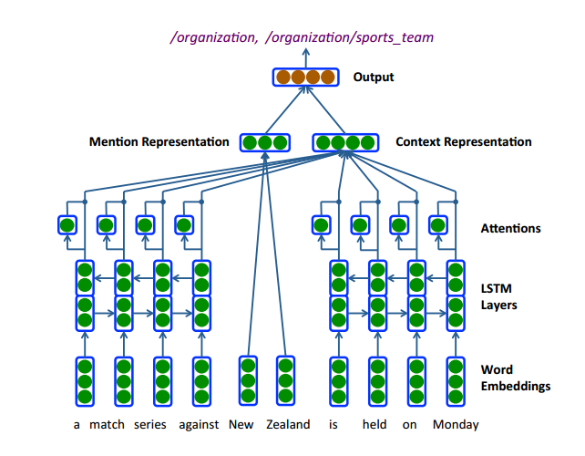
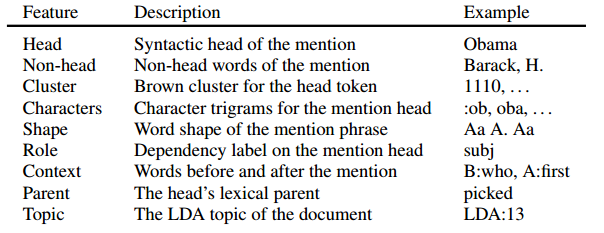
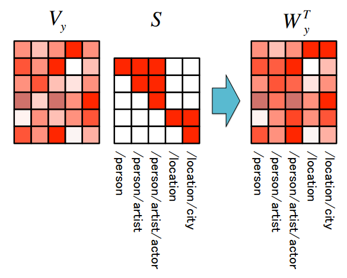
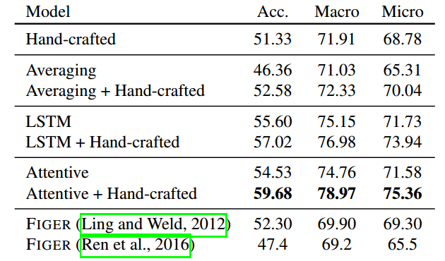

> Title: Neural Architectures for Fine-grained Entity Type Classification 
>
> Author: Sonse Shimaoka, Pontus Stenetorp, Kentaro Inui, Sebastian Riedel
>
> Link: https://arxiv.org/pdf/1606.01341

## 包含文章

1. An Attentive Neural Architecture for Fine-grained Entity Type Classification 
2. Neural Architectures for Fine-grained Entity Type Classification 

这两篇文章是同一组作者做的，相关内容也比较类似，因此放到一起进行介绍

## 问题定义

Named Entity Typing (NET)主要是为实体表示（entity mention）标记其类别的一个任务，输入一般是一个句子，包含情境和实体表示，一般用$[C_{-s}, C_{-s+1}, ..., C_{-1}][w_1, w_2, ..., w_n][C_1, C_2, ..., C_s]$表示，输出的结果就是实体表示的类别，和传统的分类任务不同的地方在于，实体表示有可能是属于多个类别的（如果分类粒度比较细的话），而且这些类别之间也存在包含关系之类的，这点就比较复杂了，目前比较常用的做法是*首先根据输出概率，选择一个最大的作为entity mention的类别（保证至少有一个类别），然后设定阈值，大于阈值的都可以认为是该entity mention的类别。*

## 模型框架

该框架展示了基于神经网络的NET模型的基本结构，在本文中利用上图对该 框架进行简单介绍

### Entity Mention表示

首先得到每个词的词向量，将entity mention中的所有词向量做平均，得到entity mention的表示，考虑到entity mention一般不是很长，所以该方法简单有效，当然也可以使用RNN之类的方法进行表示，

$$v_m = \frac{1}{M}\sum_{i=1}^Mu(m_i), \quad \tag{1}$$

其中，u就是将每个词表示为它的词向量表示。

### context表示

很容易理解，entity mention的语义是十分依赖其所存在的情境的，如果是在一个句子中的话，那么该情境信息就是上下文的词，在本文中，作者通过三种方法来处理这些词：

1. 和entity mention表示类似，采用和平均的方法

   $$v_c = \frac{1}{C}\sum_{i=1}^{C}[u(l_i), u(r_i)], \quad \tag{2.1}$$

2. 考虑到情境信息是一个序列关系，因此也可以采用LSTM来处理

   $$h_i, s_i = lstm(u_i, h_{i-1}, s_{i-1}), \\\\ v_c = [\overrightarrow{h_C^l}, \overleftarrow{h_1^r}] \quad \tag{2.2}$$

3. 单纯那最后一个状态进行拼接并不能有效利用LSTM中的信息，因此注意力机制派上了用场，这里采用了得是一种类似于self-attention的方法：

   $$e_i^l = tanh(W_e[\overrightarrow{h_i^l}, \overleftarrow{h_i^l}]) \\\\ \widetilde{a}_i^l = exp(W_ae_i^l) \\\\ a_i^l = \frac{\widetilde{a}_i^l}{\sum_{i-1}^C\widetilde{a}_i^l+\widetilde{a}_i^r} \\\\ v_c = \sum_{i=1}^{C}a_i^l[\overrightarrow{h_i^l}, \overleftarrow{h_i^l}] + a_i^r[\overrightarrow{h_i^r}, \overleftarrow{h_i^r}], \quad \tag{2.3}$$

   从这里我们可以看出是由各自的输入决定各自的权重，但在最后计算整体的权重正规化时同时考虑了左侧和右侧的权重，在这里将这两部分同时考虑，最后得到一个加权和作为最后的context表示。

## 分类

分别得到entity mention和context的表示之后，普遍的做法是直接将这两部分拼接起来，然后进行逻辑回归，

$$y = \frac{1}{1 + exp(-W_y[v_m, v_c])}, \quad \tag{3.1}$$

有了预测结果，考虑到这是一个分类任务，那么就可以使用交叉熵作为损失函数，

$$L(y, t) = \sum_{k=1}^K-t_klog(y_k) - (1-t_k)log(1-y_k), \quad \tag{3.2}$$

在这个损失函数中，K表示所有的类别数，t是预测出来的二值向量，即在每个类别上都要做一个二分类，根据之前的介绍，这部分需要这么做，因为他的分类结果是不一定的。

这就是基于神经网络的NET模型的大体框架，从我看到的几篇文章中，基本上都是用了这样的框架，只是在处理细节上略有不同，

## 额外部分

本文题目的这篇文章可以认为是作者对前一篇工作的改进，具体改进部分有两点：

### 人工特征信息

考虑到有些人工特征信息是十分重要的 ，但如果直接让模型去学习，需要花费很大的精力，现在整个神经网络结构也趋向于加入一些简单的人工特征信息，本文也是考虑到这些信息，具体如下图：

这些特征基本上将entity mention的一些语义信息，主题信息等考虑了进去，相当于增加了很多先验知识，这个还是十分有用的，那如何加这些信息呢？作者首先用0，1向量表示这些特征信息，然后将其映射到低维空间，最后得到人工特征的向量表示

$$v_f = W_ff(m). \quad \tag{4.1}$$

然后将其加入到公式(3.1)中的拼接向量，变为如下形式：

$$y = \frac{1}{1 + exp(-W_y[v_m, v_c, v_f])}, \quad \tag{4.2}$$

这个还是很有特点的，一般我们都是将这些特征信息加入到最初的输入中，这样丰富了输入的信息，整个模型也可以更好地利用这些信息，这个方法个人感觉这些特征信息利用的不够充分。

### 分层标签编码

这是本文另一个很有意思的地方，首先，作为分类目标，其实考虑到他的类别表示，也是可以使用词向量进行编码的，而且这么做有一个好处，一些不常见的标签可以通过这种方式找到离他比较近的语义空间向量，从而能够更准确的进行分类，作者也是考虑到这样的信息，同时分类内容比较细的话，标签信息之间具有包含关系，因此，作者使用0，1向量表示类别信息，同时包含high-level和low-level的标签，然后对它们进行混合编码，而不是每个类别一个向量表示，具体可以从下图感受：

然后就得到了类别表示矩阵$W_y$，巧妙地地方在于，作者使用这个矩阵表示作为公式（4.2）分类层的参数，从而很好的将类别信息引入到了分类过程中，这样模型在分类的的时候就能获取更多的信息了，这个信息融合方式还是很有意思的。

## 实验结果

照例贴出最后的结果图，作者的方法虽然简单，但还是很有效的

## 个人总结

这篇文章展示了基于神经网络的NET模型的基本结构，包括对context的处理，对entity mention的处理，attention的使用，人工特征的添加等，是一篇很不错的文章，同时该方法也有很多地方值得改进，例如人工信息的利用，注意力机制，对文本信息的处理等，感觉还是有很多地方可以改进的，值得思考↖(^ω^)↗