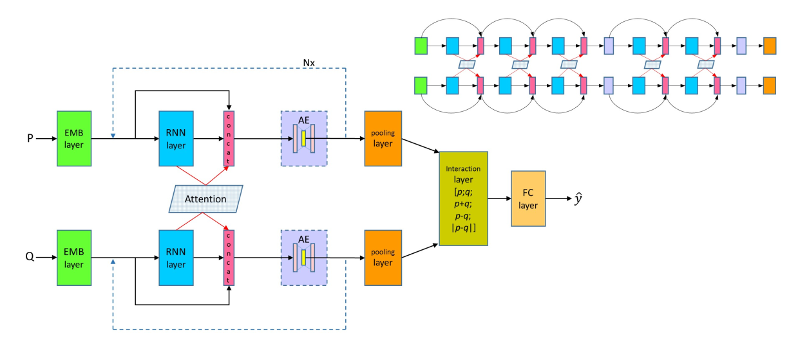
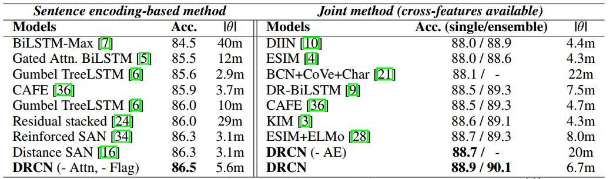
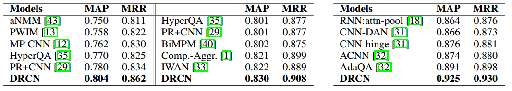

> Title: Semantic Sentence Matching with Densely-connected Recurrent and Co-attentive Information
>
> Authors: Seonhoon Kim, Jin-Hyuk Hong, Inho Kang, Nojun Kwak
>
> Link: https://arxiv.org/abs/1805.11360

句子匹配（Sentence Matching）是自然语言理解任务中一个非常重要的任务，例如Natural Language Inference，Paraphrase Identification，Question Answering等都可以归属于这个任务。这个任务主要就是理解句子语义，理解句子之间的语义关系。因此如何去表示这些内容就变得十分重要了。为了更好的利用原始特征信息，作者参考DenseNet，提出了一种densely-connected co-attentive recurrent neural network模型，该模型最突出的地方就是可以从最底层到最顶层一直保留原始信息以及利用co-attention得到的交互信息。接下来，就对文章进行详细了解

## 模型结构

首先是模型图：

不得不说，这个图还是很粗糙的，一点都不够精致，但模型的基本单元以及整体框架已经完全包含进去了，我们姑且用这个图对模型进行分析吧

### 输入层

自然语言的任务首先就是输入层，对每个词的one-hot表示进行embedding，

$$e_{pi}^{tr}  = E^{tr}(p_i), \\\\ e_{pi}^{fix}  = E^{fix}(p_i), \\\\ c_{p_i} = Char-Conv(p_i), \\\\ p_i^w = [e_{pi}^{tr}; e_{pi}^{fix}; c_{p_i}; f_{p_i}], \quad \tag{1}$$

这几个公式很好理解，首先作者将词的embedding分为两部分，一部分参与训练，即$E^{tr}$，另一部分是固定不动的，即$E^{fix}$，然后就是词级别的表示char-Conv，以及一些exact match的匹配特征，主要是a中的每个词是否在b中有对应的词，然后将这些表示拼接起来，就得到了每个词的最后表示$p^w_i$。

### 密集连接层

在这一层，作者收DenseNet启发，使用了密集连接和RNN结合的方法来实现对对句子的处理。首先$h_t^l$表示的是第l层的RNN的第t的隐层状态，

$$h_t^l = H_l(x_t^l, h_{t-1}^l), \quad x_t^l = h_t^{l-1}, \quad \tag{2.1}$$

$$h_t^l = H_l(x_t^l, h_{t-1}^l), \quad x_t^l = h_t^{l-1} + x_t^{l-1}, \quad \tag{2.2}$$

$$h_t^l = H_l(x_t^l, h_{t-1}^l), \quad x_t^l = [h_t^{l-1}, x_t^{l-1}], \quad \tag{2.3}$$

式2.1是传统的多层RNN的结构，前一层的RNN的 隐层状态作为当前层的输入，然后就是RNN的计算方式，式2.2借鉴了残差网络，当前层的输入不仅包含了前一层的隐层状态，同时包含了前一层的输入，但他们是相加的方式，作者认为这种相加的形式很可能会阻碍信息的流动，因此借鉴DenseNet，作者使用了拼接了方式，这样不仅保留了两部分信息，同时拼接方法也最大程度的保留了各自的独有信息。但这就有一个问题了，多层的RNN的参数就不一样了，因为拼接的方式导致了每一层输入对应的参数规模是在不断变大的，这样就不能做的很深了。

### 密集连接注意力

因为句子匹配考虑的两个句子之间关系，因此需要建模两个句子之间的交互，目前来说，注意力机制是一种非常好的方法，因此作者在这样也使用了注意力机制，

$$a_{p_i} = \sum_{j=1}^{J}\alpha_{i,j}h_{q_j}, \\\\ \alpha_{i,j} = \frac{exp(e_{i,j})}{\sum_{k=1}^Jexp(e_{i,k})}, \quad e_{i,j} = cos(h_{p_i}, h_{q_j}), \quad \tag{3.1}$$

这个就是传统的co-attention计算方法，计算两个序列之间的在每个词上的对应关系，不过作者这里比较粗暴，直接使用了余弦相似度来计算每两个词之间的相似，这里也可以使用一个简单的MLP来计算。有意思的地方在下边

$$h_t^l = H_l(x_t^l, h_{t-1^l}), \quad x_t^l = [h_t^{l-1}, \alpha_t^{l-1}, x_t^{l-1}], \quad \tag{3.2}$$

这个就很有意思了，我们传统的做法是得到每个词在对方句子上的概率分布之后，使用对方句子中每个词向量的加权和作为当前词的向量表示，而这里作者直接使用了计算出来的权值分布，将其作为一个特征引入到当前层的输入当中，这个感觉还是很有意思的。

### 瓶颈处理层

正如前边提到的，这种dense连接方式直接导致的一个问题就是随着模型的加深，参数量会变的越来越多，这样最后全连接层的压力就会特别大。因此作者在这里使用了一个AutoEncoder来解决这个问题。AutoEncoder可以帮助压缩得到的巨大向量表示，同时可以保持原始的信息。这个操作还是很不错的。

### 分类层

这是处理两个句子关系常用的一种匹配方法，作拼接，相减，点乘，不过作者在这里也是用了相减的绝对值，然后将最终拼接的向量通过一个全连接层，然后根据任务进行softmax分类，我个人做过实验，相减的效果要好于相减的绝对值，因为相减不仅可以表示差异，同时可以表明信息流方向，而相减的绝对值就更专注于差异了，两个都用应该是效果比只用一个好的。

## 实验结果

照例，上图，作者在NLI任务和Question Pair两个任务上进行了模型验证，效果当然是十分不错的。

## 感想

这篇文章主要集中在句子匹配任务上，将DenseNet的一些想法引入到了stack RNN中，还是可以给人一些灵感的，比如说从残差连接到DenseNet，比如说注意力权值的使用方法，比如说利用AutoEncoder来压缩向量，这些还是十分值得学习的。♪(＾∀＾●)ﾉ