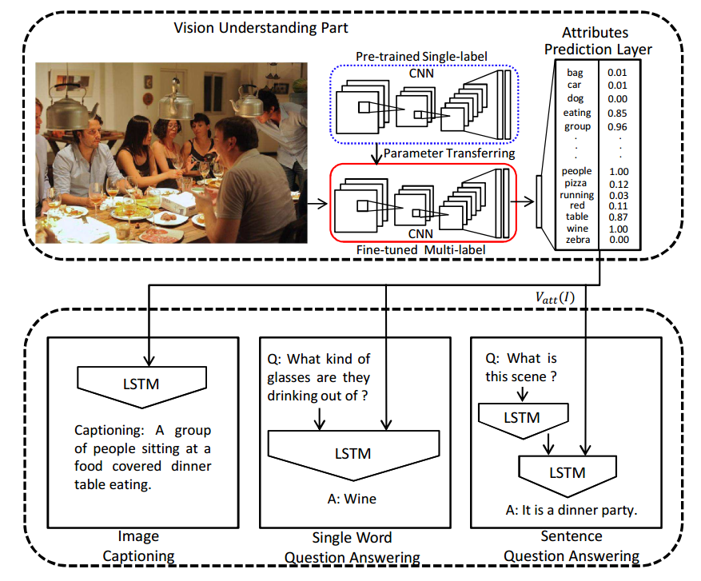
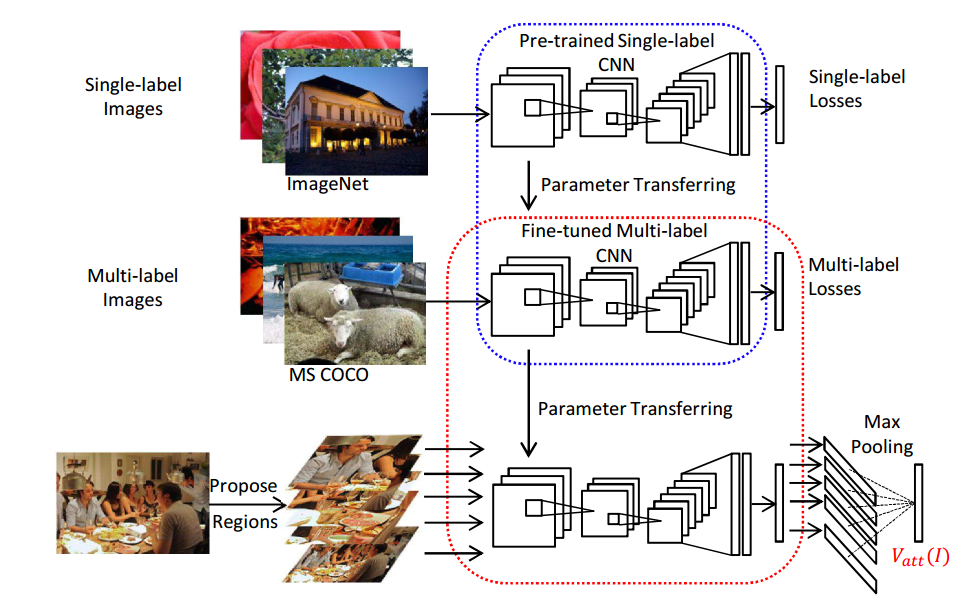
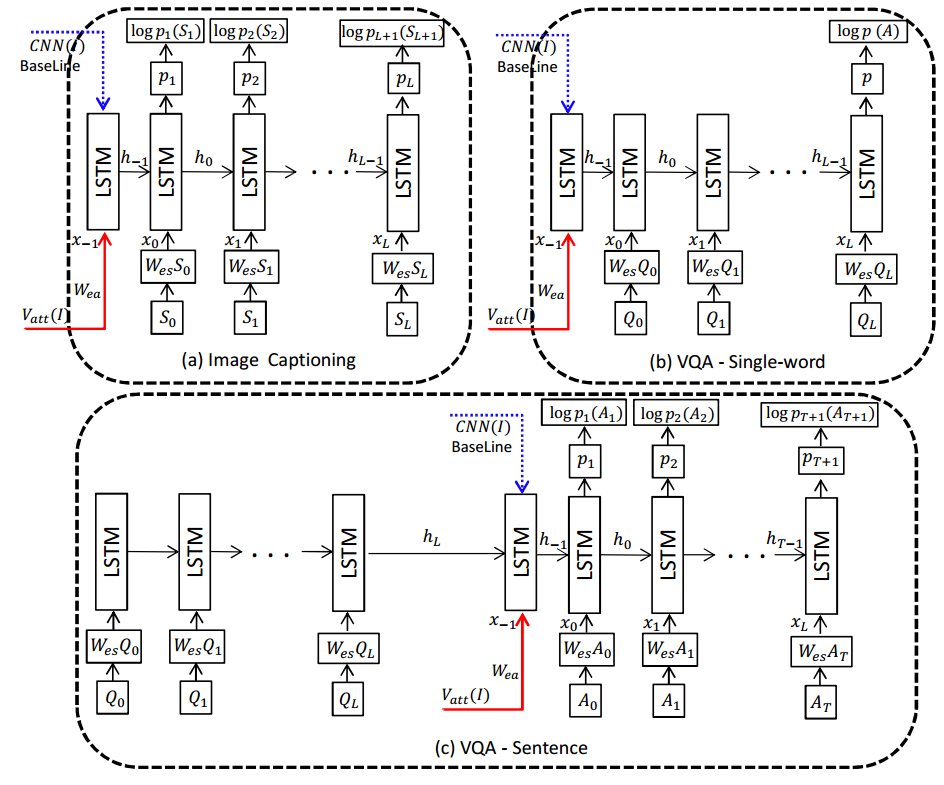
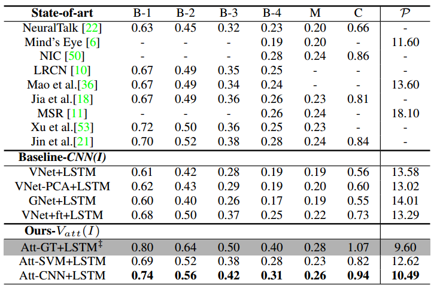
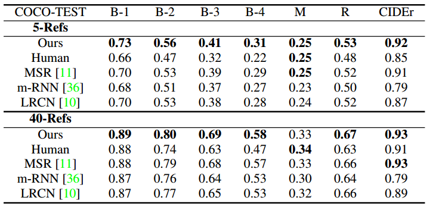

> Title: What Value Do Explicit High Level Concepts Have in Vision to Language Problems?
>
> Authors: Qi Wu, Chunhua Shen, Lingqiao Liu, Anthony Dick, Anton van den Hengel
>
> Link: https://arxiv.org/abs/1506.01144

## 背景

Vision-to-Language(V2L)主要是研究图像和文本的联合建模，利用图像为文本提供丰富的辅助信息，利用文本为图像提供高层次的抽象信息。该主题有着越来越多的应用场景，例如Image Captioning，Visual Question Answering, Visual Dialog等等。目前常用的方法就是利用CNN来处理图像，利用RNN来处理文本，然后直接整合或者通过Attention Mechanism来整合。那么，这些方法是否真正理解了图像的意义，或者说利用CNN的方法是否真的获取到了图像的高层次的抽象信息。针对这个问题，本文在CNN-RNN的基础上提出了一种利用图像高层次语义的方法，并在多个任务上验证了其有效性。

## 模型框架

首先展示模型的基本框架

从图中我们可以看出模型的大致结构

1. 利用预训练的模型，经过transfer learning之后得到multi-label的模型结构，并将图像输入抽取到一个对应的属性向量
2. 将得到的图像属性应用到不同的V2L任务当中去。

那么很重要一点就是如何将图像用一个属性向量表示，这部分，在本文中，作者称其为属性预测器，接下来就来详细了解一下这个属性预测器。

## 属性预测器（Attribute Predictor）

1. 属性字典：

   既然要使用高层次的抽象表示来表示图像的信息，那么最直接的方法就是和自然语言建立联系，因此作者首先建立了一个属性字典。为了保证得到的词和图像之间紧密相联，作者使用了image captioning中的图像和描述，然后抽取频率最高的c个词，为了保证效果同时降低属性字典的大小，该字典是时态，单复数不敏感的，也就是说“dogs”和“dog”是同一个属性，最后就建立了一个大小为256的字典。有了这个字典，就可以利用图像的描述将图像和属性字典联系起来了。

2. 多标签分类：

   为了将图像和属性联系起来，作者将这个问题看作是多标签分类问题，具体方法如下图：

   

   从图中我们大致可以看清楚整个流程，作者使用了预训练好的VGG模型作为模型的初始化参数，然后在该模型方法image captioning数据集MS COCO上进行fine-tune，这一步，作者将最后一层改为一个c分类的模型，c就是属性字典的大小。在这里，作者使用了element-wise logistic loss function。也就是说在图像的描述中，如果存在某个属性$y_i \in c$，那这个$y_i=1$，否则$y_i = 0$，然后损失函数就可以写为

   $$J = \frac{1}{N}\sum_{i=1}^{N}\sum_{j=1}^{c}log(1+exp(-y_{ij}p_{ij})), \quad \tag{1}$$

   在fine-tuning过程中，只有VGG的最后两个全连接层和模型的最后一层进行训练，其他层保持不变。

   在此基础上，考虑到不同的属性关注的仅仅是图像中的某一个区域，因此作者首先使用了一种normalized cut的算法将图像切分为m个聚类，然后每个聚类中的图像块在区域划分算法中评分比较高的top-k会被挑选出来送给CNN，这个CNN就是上一个fine-tuning之后的结果。同时为了更好的表示图像，作者也将整幅图像送给该CNN，这样就有了mk+1属性表示向量，最后作者使用一个maxpooling操作，得到图像的最终属性表示向量$V_{att}(I)$。这个是一个十分重要的表示

## 语言模型

这部分相对来说和一般的做法差别并不大，作者分别在Image captioning，VQA-single word和VQA-sentence三个任务上进行验证，首先看如何将这个属性向量插入

蓝色虚线是对比方法，红色实线是图像的属性向量，这个还好理解的。Image captioning模型中使用属性向量作为-1时刻的输入（并不是直接作为隐层状态的初始化，经过了一个线性变换）；VQA-Single-word任务中也是一样的操作；VQA-sentence任务中就是将其作为生成器的初始化输入。

这部分相对来说比较简单，个人感觉作者可能认为在图像处理阶段已经将图像使用高层次的抽象信息表示了，在这里就是自然语言了，有了这个中间桥梁，图像和对应的文本之间就更好关联起来了，因此一般都将其放到了语言模型的初始化部分。当然，也正是因为这样，语言模型处理的可以认为基本上都是文本信息，因此就会有比较好的表现效果。

## 实验结果

照例还是直接上实验结果图：

作者使用的数据集主要是MS COCO，Flickr8k和Flickr30k，实验结果证实了作者的方法确实十分有效，作者也在VQA上进行了一些验证，这里就不再展示了。

## 总结

传统的V2L任务中，大家一般都是利用预训练好的图像模型来抽取图像特征，然后将其应用到语言模型中，作者在这里给我们提供了一种新的思路，利用已有的信息，为图像和文本之间建立一个桥梁，这样直观的信息表示和抽象的信息表示能够更好的融合在一起，从而为更好的理解语义，理解图像提供支撑。我自己还有一个想法：目前使用的预训练模型一般都是在ImageNet上进行训练的，而ImageNet主要是一个分类图像数据集，因此这些模型抽取的特征可能更多的服务于分类任务，但将其利用到V2L时是不是就会有一些信息偏差呢，是不是利用比如说做目标检测的图像预训练模型会有不一样的效果呢？值得思考↖(^ω^)↗