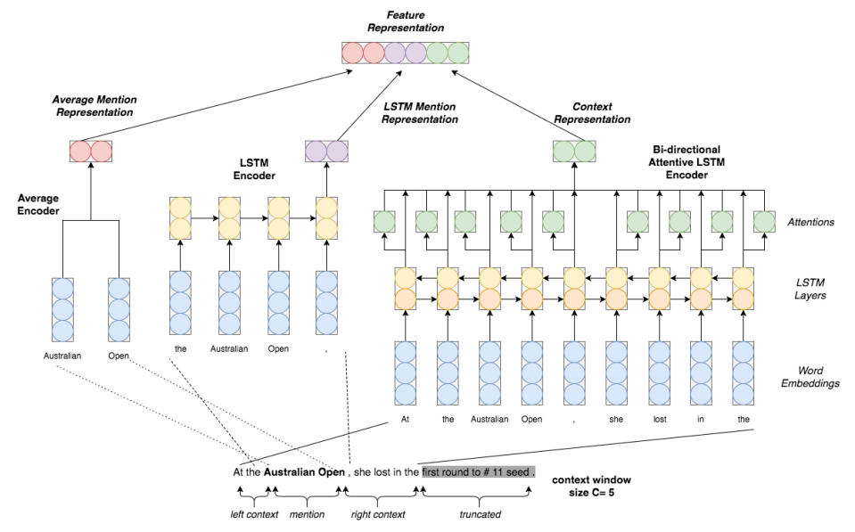

### 相关文章

1. Neural Architectures for Fine-grained Entity Type Classification 
2. Neural Fine-Grained Entity Type Classification with Hierarchy-Aware Loss 
3. Fine-grained Entity Typing through Increased Discourse Context and Adaptive Classification Thresholds 

### 文章1

#### 模型图

这是相对来说比较早的一篇利用神经网络来解决NET问题的工作，从模型中大致可以看出该模型的基本框架，1）预训练的词向量进行embedding，2）针对entity mention周边的context，分别使用不同的Bi-LSTM进行处理，并在其隐层状态上使用attention，最后得到context的向量表示，针对entity mention，直接使用平均的方法，将所有词的向量加起来，得到entity mention的向量表示，最后使用一个MLP进行分类。

#### 亮点

文章在考虑label的时候，使用了hierarchical label encoding的方法，具体来讲，fine-gained label具有先天的层次化特征，例如person/artist/actor，如果预测entity mention的label为actor，那么理论上是可以回溯上去的，得到person/artist，因此作者考虑将这些信息进行层次化联合编码，还是使用one-hot的表示方法，不过对应的label都会得到1，因此一个label中不只有一个1，然后乘以一个embedding矩阵，得到label的低维表示，然后将得到的低维表示作为最后分类层的参数，进行分类，这个就很有意思了，具体实现过程，可以参见下图：

##  

### 文章2

#### 问题

1. 噪声问题

   NET任务有一个很大的问题，那就是数据的问题，目前常用的几个数据集，FIGER，OntoNote，WiKi基本上都是通过如下步骤生成的：

   1. 在句子或者文档中使用NER等工具标记entity mention
   2. 将得到的entity mention和知识图谱中的entities做关联
   3. 找到知识图谱中每个entity的类型，将其作为目标entity mention的候选类型

   从这个流程中就可以看出来一个问题，得到的type类型有很高的噪声，而且针对一句特定的句子或文档，这些候选类型中后很多是不符合情境的，也就是说上面的方法在做标注的时候是无法考虑情境的，例如下图

   

   如果只考虑句子s1，那么得到的type就应该是person/coach，如果只考虑句子s2，那能得到的type就应该是athlete，

2. 标注过细问题

   还是上图的例子，如果只考虑句子s3，那么得到的就只能是person，但是由于这个人是个名人，因此在知识图谱上会给他标记上很多很细的type，这会导致在训练的时候，模型会更喜欢分这些很细的类别，而不是一般的，但是符合句子情境的类别。

针对以上问题，作者提出了自己的模型，关键的地方在于作者设计的loss function

#### 模型

这个模型还是很简单的，相对于上一个模型，在该模型中，作者将考虑的重点放在了entity mention上边，具体流程如下：

1. embedding layer将句子中的每个词进行embedding
2. 针对entity mention，a）将所有词的向量做平均，得到 一个表示；b）在entity mention的基础上左右各扩展一个词，然后将得到的这个短语通过一个LSTM，然后将最后一个状态作为entity mention的另一种表示
3. 针对context，不再是考虑使用不同的LSTM来处理两边的内容，而是处理整个句子，然后在隐层状态上做attention，最后得到一个加权和作为context的表示，这里的attention是在整个句子上做self-attention。
4. 将得到的三个向量作拼接，然后将结果送给分类器进行分类

#### 损失函数

针对数据上存在的两个问题，作者在损失函数上做了一些巧妙地调整。

1. out-of-context noise

   针对这个问题，作者在计算损失时，不是考虑所有类别上的损失，即传统的loss function

   $$J(\theta) = \frac{1}{N}\sum_{i=1}^{N}y_ilog(p(y_i|m_i, c_i)) + \lambda||\theta||^2, \quad \tag{1}$$

   在这个公式里，$y_i$是一个向量。作者只考虑其中概率最大的类别，即$y_i^{'} = argmax_{y\in y_i^t}p(y|m_i, c_i)$，这样损失函数就变成了

   $$J(\theta) = \frac{1}{N}\sum_{i=1}^{N}(y_i^{'}log(p(y_i^{'}|m_i, c_i)))+ \lambda||\theta||^2, \quad \tag{2}$$

   作者这么做，是假设在训练集中获得概率最高的类别是真正符合情境的类别，而概率比较低的类别就和情境不太搭了，这其实也是有一定 道理的，而且很巧妙地将情境信息的作用引入进了模型。

2. overly-specific noise

   针对这个问题，作者提出了一种Hierarchcical Loss Normalization的损失函数，因为越细粒度的类别，他们所占的比重应该是不一样的，例如如果选择了athlete这个标签，那么较粗的粒度肯定要选择person，而不是location之类的，而传统的loss function在优化时，就是将他们平等对待的，因此作者希望损失函数能够更少的惩罚那么相关联的那些标签，即

   $$p^{'}(y|m,c) = p(y|m, c) + \beta\sum_{t\in\Gamma}p(t|m,c), \quad \tag{3}$$

   其中，$\Gamma$就是在类型路径上属于$y$的祖先节点，这样对类型进行分类处理，这样在最后的分类预测时就可以降低不同类别的噪声的影响了。

这就是这篇文章的大体框架，主要是在噪声处理上一些措施，感觉还是值得借鉴的

### 文章3

这篇文章也是针对第一篇文章进行的一些改进，主要在以下的几个地方：

1. context不再是独立处理
2. 针对context的attention，要考虑到和entity mention之间的对齐关系
3. 增加了文档级别的context
4. 不再考虑人工特征，并通过实验证明人工特征加进去对模型的提升并不大

#### 模型

从模型图里可以看出来整个模型的框架，

1. entity encoder：相同的方法，首先embedding，然后进行进行平均，得到entity的表示
2. sentence-level context：就是entity所处的句子，将其通过一个L层Bi-LSTM，然后利用隐层状态和entity表示之间的dot product计算attention，最后对所有的隐层状态做加权，得到句子级别的context表示
3. document-level context：这部分相对简单一些，做着先使用了一个预训练好的模型（gensim.doc2vec）得到文档的表示，然后通过一个多层感知机，得到文档级别的context表示
4. 拼接起来，得到输入的特征表示，在此基础上，将类别也进行embedding，最后通过一个逻辑回归得到该entity输入每个类别的概率，
5. 这点独立写出来，算是作者的一个亮点，作者不是使用一个统一的阈值来决定eneity mention属于哪个类别，而是使用了 一种自适应的阈值，每个不同的类别都有一个属于自己的阈值，该阈值是通过模型学出来的，然后预测出来的概率只有超过该阈值才能说属于该类别。

#### 分析

作者对结果进行了一些分析，得到以下两点：

1. 人工构建的特征作用并不大，可能是因为这些人工特征大多都是关于语法或者主题的一些信息，而这些信息都通过注意力机制和文档级别的context已经得到了，因此再补充这些信息的意义不大
2. 对类别进行层次化编码的效果也很小，并做作者通过一些例子展示，说明entity mention是依赖情境的，属于不同粗粒度的类别可能由于情境的原因而被标记为entity mention的类别，也就是说类别的层次化信息其实意义不太大，（对这点我持保留态度）

### 总结

从这三篇文章中基本上可以看到目前使用神经网络做NET的一些基本方法以及面对的一些问题，个人感觉可以从以下几点考虑新的方法：

1. entity mention的表示
2. context的选择及表示
3. label的表示，包括噪声的处理，层次化信息的运用等，

目前基本上只想到这些，感觉从这个地方搞起来还是有很多可以做的东西，♪(＾∀＾●)ﾉ