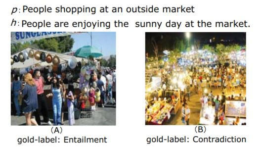
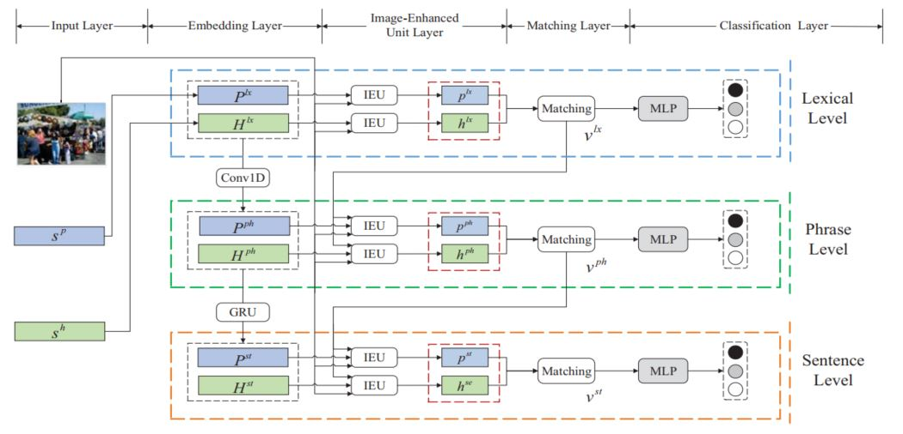
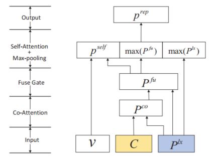
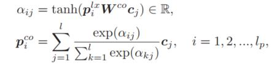
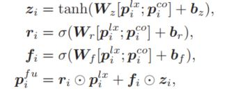
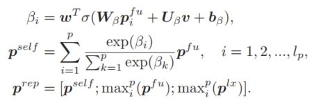
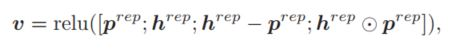
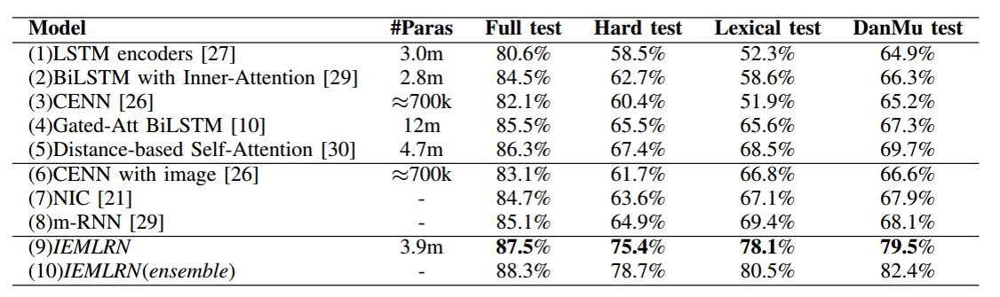
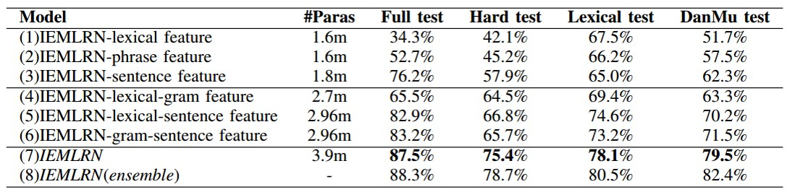

> Title: Image-Enhanced Multi-Level Sentence Representation Net for Natural Language Inference
>
> Authors: Kun Zhang, Guangyi Lv, Le Wu, Enhong Chen, Qi Liu, Han Wu, Fangzhao Wu
>
> Link: https://ieeexplore.ieee.org/abstract/document/8594899/

## Motivation

自然语言理解(Natural Language Inference)主要是用于分析两个句子（前提句p，假设局h）之间的语义推理关系，包括Entailment(可以从前提句的语义推理出假设句的语义)，Contradiction(不能从前提句的语义推理出假设句的语义)，Neutral(无法确定是否能从前提句推理出假设句)。在真实条件下，自然语言句子的语义时高度依赖情境信息的，相同的句子可能会因为情境信息的不同而表达出不同的语义信息，这也是自然语言句子本身语义的模糊性，二义性等特点导致的，就如下边的例子

如果单纯看两个句子，我们可能会因为*outside market*而推理出天气是*sunny day*，但实际上这也不是能够十分明确的；而加入了情境信息的话，情况就会有所不同，例如图A，那么两个句子之间的语义关系就是Entailment，但换成图B的时候，因为时间变成了晚上，那么两个句子之间的语义关系就成了Contradiction。而目前大多数的方法在对句子语义进行建模的时候都假设句子是独立于情境的，这明显是不够充分的，因此，本文从这个角度出发，提出了将图像信息融入到句子语义建模过程中，从而增强句子的语义理解，得到更加准确全面的语义表示。

## Model

首先是完整的模型图

从整体上看，模型是一个3-level的结构，在每一层的结构中包含了5个组件

- Input Layer：整个模型的输入层，包括两个句子的词的输入，图像的特征输入
- Embedding Layer：从不同的粒度对句子中的信息进行表示，分别是词级别，短语级别，句子级别
- Image-Enhanced Unit Layer：图像增强单元层，利用图像信息对句子语义表示进行增强，从而得到句子语义更加全面准确的表示
- Matching Layer：对得到的句子语义表示进行匹配操作
- Classification Layer：对输入的两个句子进行语义推理关系分类

首先对输入层进行简单描述，输入的信息包含图像和文本，针对图像，作者选择了VGG19模型进行特征抽取，选择最后一个卷积层的结果作为图像的特征表示；针对文本，作者利用了预训练的词向量(glove 840b)，字符级别的embedding，以及一些人工特征的拼接，作为文本中每个词的表示。接下来将对模型的几个结构进行详细分析

### Embedding Layer

和传统的直接拿embedding好的词向量作为模型的最终输入不同的是，本文首先从不同粒度对模型输入进行处理。这里为什么要这么处理呢？因为本文最终是要通过图像信息对句子的语义表示进行增强，而图像包含的信息要远远高于文本，并且它可能对应到文本的不同粒度上，可能是某个词，也可能是某个短语，另一方面，对文本的多粒度建模可以更好地对句子语义进行分析，因此，本文首先对原始的词向量进行一维卷积（使用unigram, bigram, trigram），得到了句子的短语表示，需要说明的是，这里的短语并不是真正的短语，只是一个局部的特征。在此基础上，使用了GRU对短语级别的表示进行处理，这样就知道了一个全局信息，这里作者称之为句子级别的表示。

在接下来的内容中，以词级别的作为例子，剩下的两个粒度信息使用的是相同的结构。

### Image-Enhanced Unit

首先是该结构的详细图解

该结构的输入为三部分，一个附加的情境信息$v$，图像的特征表示$C$，以及文本序列的表示$P^{lx}$，这里使用的词级别的前提句的序列表示矩阵作为例子。首先要做的就是利用图像的特征表示来从另一个角度表示文本中的每个词，很自然的，co-attention方法是首选：

通过该操作，模型就可以利用图像中的相关信息对文本的语义表示进行增强，相当于从另外一个角度对每个词进行了表示，那么接下来最简单的方法就是把两个结果拼接起来，但这样会让模型的参数规模变大，并且是否可以将来自图像的信息表示和来自文本的信息表示同等对待也值得思考，在本文中，作者仿照GRU的结构，对这两部分的表示进行了一个融合，从而更好的利用这部分的信息：

融合之后就得到了每个词的增强表示，接下来需要做的就是如何将这些信息融合，得到句子的语义表示向量，这里作者使用了self-attention机制，并同时使用了最大池化操作（max-pooling），这样对句子语义表示重要的信息会被选择出来，同时对语义表示最重要的信息也会被选择出来进行重点突出，通过这种方式，就可以得到句子语义全面的一个表示：

从公式中可以看出，作者最后将这三部分内容拼接起来，作为最终的句子的语义表示向量。同样的操作也会放到假设句子上，这样就得到了两个句子的增强语义表示。需要强调的是这里的$v$，这是一个被称之为inference vector的向量，会在下一部分详细分析

### Matching

这部分就相对比较简单了，将得到的两个句子的语义向量表示进行启发式的匹配操作

这里，直接拼接可以保留所有的信息，相减操作可以指明推断方向，同时是一种最朴素的差异判断方法，而点乘可以认为是一种最简单的相似度计算方法，通过这样的操作，就可以得到两个句子之间推理关系的一个向量表示，正如上一节所描述的，IEU单元需要有这样一个inference vector作为输入，这里作者是将上一层的inference vector送给当前层，这样模型在短语级别推理时会指导词级别做出分类的理由，这样不同粒度之间也建立了信息流动，从而随着粒度的加深，模型也能够更加准确的进行语义推理关系的分析和判断。

最后就是分类层了，通过一个简单的分类器进行分类就可以了。因为这是一个三层的结构，每一层都会分类，因此作者在训练时要求模型每一层都能分对，也就是损失函数中有这三层的交叉熵损失函数。而在预测的时候使用的是最后一层的输出结果。

以上就是模型的整体结构，一个多粒度的图像增强结构，还是很有意思的。

## Experiment Result

还是首先先上实验结果

从实验结果上看，该模型在完整的测试集上，以及更加严格的测试集上都能取得不错的效果，这也说明了模型的有效性，接下来是模型结构的有效性测试

从这个结果上看，只用单层的话，能看到的信息越多，效果越好，因此我们看到粒度越大，效果越好，并且只用词级别的表示的话，因为完全不知道句子的结构，所以结果和随机猜没有太大差别；当考虑的粒度越多时模型的效果也越好，这也说明了多粒度的考虑确实有助于对句子语义的全面理解。

不过个人感觉这部分应该加一个如果没有图像信息的话，结果 会怎么样，相当于是对图像有效性的一个检测，这样实验部分就更加全面了。

## Conclusion

本文通过将图像信息引入到自然语言推理中，利用额外补充的信息对句子语义进行增强，从而更加准确的理解句子语义，思路非常新颖，而且这种多模态的建模方法个人感觉也是未来一个比较重要的研究方向。当然本文中也有一些地方还可以改进，例如图像的利用，图像的有效性分析等都值得思考。还是一篇很不错的文章。