> Title: DRr-Net: Dynamic Re-read Network for Sentence Semantic Matching
>
> Authors: Kun Zhang, Guangyi Lv, Linyuan Wang, Le Wu, Enhong Chen, Fangzhao Wu, Xing Xie
>
> Link: https://www.aaai.org/Papers/AAAI/2019/AAAI-ZhangKun.5147.pdf

## Motivation

语义理解与语义表征一直是自然语言理解中基础但十分关键的一个内容，得益于大规模的数据和先进的深度学习技术，机器在具体的任务上的表现越来越接近人类表现，这其中注意力机制（Attention Mechanism）扮演着一个不可或缺的角色，它可以帮助模型选择出句子中对语义表达最重要的信息，从而生成一种更好地语义表示向量，但是大多数的方法都是一次性的选择出所有重要的信息，该方法明显是不够合理的。事实上，人在阅读的时候，会根据已学习到的信息去动态选择需要关注的内容。更具体的，认知心理学实验发现人在阅读的时候有两个特点：1）**人对句子中的词序其实并没有很敏感，即使打乱顺序我们依然能够理解**; 2) **人在阅读时候倾向于阅读多遍关键信息，从而实现对句子语义的精确理解**，如下图的例子：

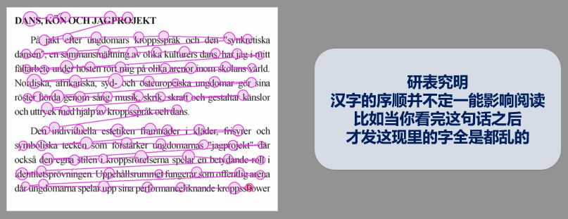

左图是利用眼球追踪仪得到的注意力分布，可以看到有些词被反复阅读，而有些词并没有被阅读到。右图虽然词序是乱的，但是我们可以利用丰富的先验知识自动纠正这种错误，从而理解句子要表达的语义。基于以上的两个现象，本文提出了一种**Dynamic Re-read**机制，通过对重点内容的自动选择和反复阅读，从而实现对语义的精确理解。

## Model

首先是模型框架

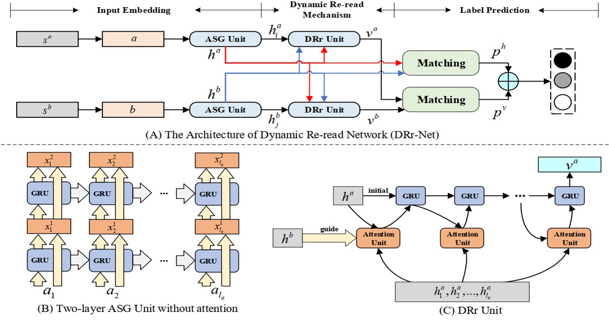

模型可以大致分为三个模块，

- Input Embedding：利用充足的特征信息对输入的每个词和每个句子进行编码
- Dynamic Re-read Mechanism：每一步只关注一个最重要的词，并且反复对重要的内容进行理解
- Label Prediction：对输入的两个句子之际的关系进行分类

接下来，文中从这三个方面对整个模型进行详细分析

### Input Embedding

对词的编码是一个常规操作，文本使用了预训练的词向量（glove 840d），字符级别的embedding，以及一些人工特征，然后将其拼接起来，为了更好地表示每个词的语义信息，本文将其通过一个两层的高速网络（Highway Network），最终得到每个词的语义表示$\{a_i | i = 1,2, ... , l_a\}$和$\{b_j|j=1,2,...,l_b\}$

众所周知，人类拥有丰富的先验知识，因此可以利用这些知识直接选择出句子中对语义表示重要的词，但这对模型而言是非常难的，因此，模型首先要做的就是对整个句子的全面理解，尽可能多的了解句子信息，这样才能为更好的理解句子语义奠定基础。为了实现这个目的，本文设计了一种修改版的Stack-RNN，它将$（l-1）$层的输入和输出拼接起来，作为$l$层的输入，通过这种类残差的结构，模型就能够保留所有的信息，该过程可以形式化为：

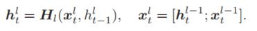

其中，$H_l$表示$l$层的RNN，这里使用的GRU作为RNN的基本单元。接下来要做的就是如何压缩这些词的向量表示，从全局的角度对句子语义进行向量表示。得益于自注意力机制（Self-attention），本文在Stack-RNN的最后输出上做self-attention，从而抽取对语义表示重要的信息，将这些信息加权求和，得到句子的全局语义表示，在文中，作者称之为original sentence representation，该过程可以由如下表示：

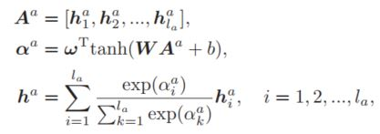

### Dynamic Re-read Mechanism

该模块主要是受人在阅读时的习惯启发而设计出来的，人在阅读时：1）**人对句子中的词序其实并没有很敏感，即使打乱顺序我们依然能够理解**; 2) **人在阅读时候倾向于阅读多遍关键信息，从而实现对句子语义的精确理解**。因此该模块要实现的目标就是如何根据已学习到的知识在每一步选择一个重要的词进行理解，以及这些重要的词该如何处理。首先，整体的过程可以形式化为：

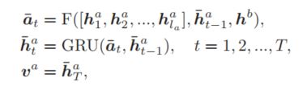

即先通过一个选择函数，在整个输入序列中选出第$t$步的输入，然后将该输入送给一个GRU，而最后重要信息表示向量使用的是GRU的最后一个输出状态，因为GRU的在每个时刻的输入是动态变化的，因此作者将其称之为Dynamic。从该公式可以看出选择函数需要的输入有三个：a句子的整个序列，动态RNN的前一个时刻的隐层状态，b句子的全局语义表示，因为该模型针对的是句子语义匹配任务，因此作者将b句子的全局语义表示作为一个额外的context信息，这样模型就能更好的选择出符合上下文的语义信息。针对选择函数，作者利用了注意力机制来实现选择过程：

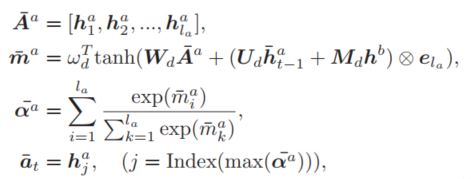

相当于通过注意力机制在整个序列上计算出来当前时刻的重要程度分布，然后选择最大的权值对应的词，将这个词作为当前时刻的输入，然后将其送给GRU，但是，该过程有一个问题，最后一个公式选择出索引的操作是不可导的，这里作者做了一个trick，对softmax函数加了一个任意大的常数$\beta$，这样权值最大的就趋近于1了，而其他的权值就趋近于0了，通过这种近似的方法，实现了最后的选择操作，并保证可导。因此，上式可以修改为：

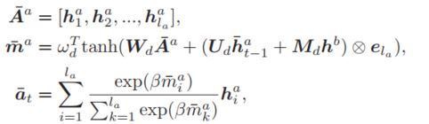

这就完成了整个动态选择的过程

### Label Prediction

经过前两个模块，模型就生成了全局语义表示和局部重要表示，接下来作者通过启发式的拼接操作来整合这些信息，具体可以通过如下公式表示：

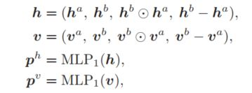

这里是分别使用了不同的语义表示进行分类，为了是结果更准确，鲁棒性更好，作者设计了一个简单的加权方式将这两个结果进行融合，从而最终进行分类。

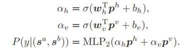

以上就是模型的整体结构。

该模型的创新点主要集中在Dynamic Re-read机制的设计上，作者通过模仿人的阅读习惯，每次只选择一个重要的词，然后对这些重要的词进行反复阅读，从而实现对句子语义的准确理解。

## Experimental Results

首先是实验结果图

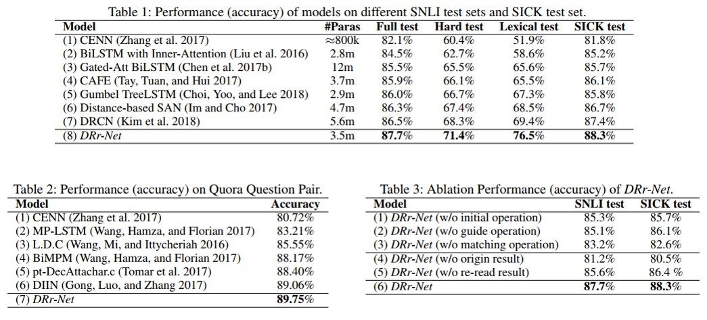

作者在两个任务，三个数据集上进行了测试，从实验结果上看，模型取得了非常不错的效果。同时为了验证模型的有效性，作者还对每个模块进行了验证，从结果上看，这其中最重要的还是全局的语义表示，重要信息的局部表示是在最好的结果上进行了提升，其重要程度要弱于全局语义表示。个人推测人在阅读时可以利用丰富的先验知识去直接挑选重要信息，而这对模型来说就有些困难了，他需要首先做的是对句子信息的整体把握，否则很难取得很好的效果。如果单纯只挑重要的信息的话，模型很难对句子语义有一个全面的表达。所以全局的语义表示对模型而言还是非常重要的。

为了更好地展示模型的能力，作者同时也进行了一些case study，如下图：

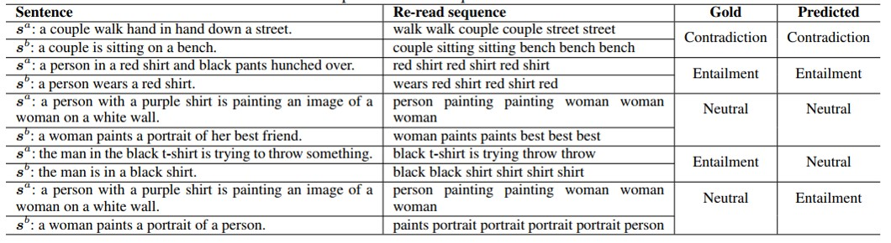

从结果上看，模型确实选择出了非常重要的词，但同时模型也在重复这些词，有时候甚至只重复一个词，最终导致模型得出错误的结论，这可能跟动态选择的过程是一个非监督的过程有关，这点还是值得仔细思考的。

## Conclusion

本文通过利用人的阅读习惯，将注意力机制一次性选择所有重要的信息的机制修改为根据上下文动态选择重要的信息，并通过全局的表示和局部的表示对句子语义进行更全面的理解表示，是一个非常有意思的工作。按照作者的思路，在相关的领域，例如semantic matching， Visual Question Answering等方面都可以进行一些尝试，这是一个很值得研究的工作。