> Title: Image-Question-Answer Synergistic Network for Visual Dialog
>
> Authors: Dalu Guo, Chang Xu, Dacheng Tao 
>
> Link: https://arxiv.org/abs/1902.09774

## Motivation

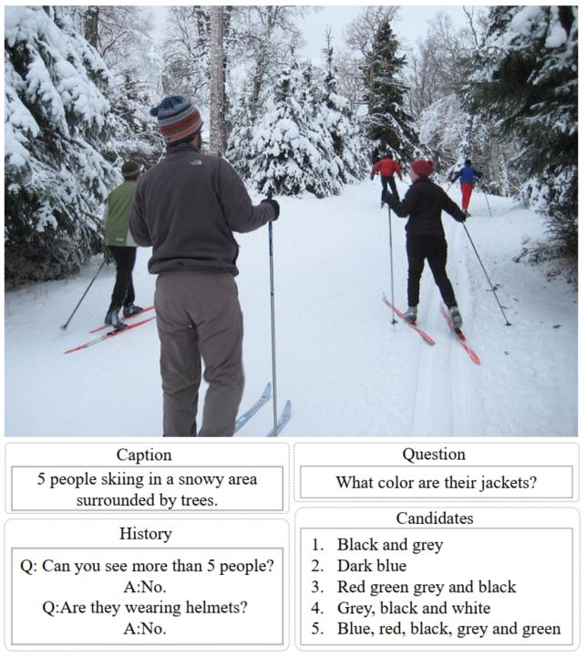

Visual Dialog作为Visual-to-Language中十分重要的一个应用，受到了越来越多的关注。如上图所示，该任务主要实施根据给出的图像，图像描述，历史对话，问题挑选出或者生成对应的答案，可以认为是一种更加复杂的VQA。典型的Visual Dialog模型一般都是融合图像，问题和历史对话内容，然后搜索或者生成最适合的答案，这就出现了一个问题，模型会更倾向于输出安全的答案，例如：yes，no等，这些答案符合情境。但是针对对话而言，这类非常短的答案完全就是对话终结者，让人找不到继续对话下去的理由。因此，在Visual Dialog中也需要考虑最后的答案扮演的角色，而不仅仅是将其作为一个输出。因此本文提出了一种图像-问题-答案协同模型，将传统的一阶段模型扩展为两阶段模型，在第一阶段根据答案和图像，问题的关联性进行粗略的选择或评分，在第二阶段，那些概率高的答案会通过与图像和问题的协同分析，以一个更细的粒度进行重新排序，从而最终选出更加符合情境的答案。

## Model

首先是模型框架：

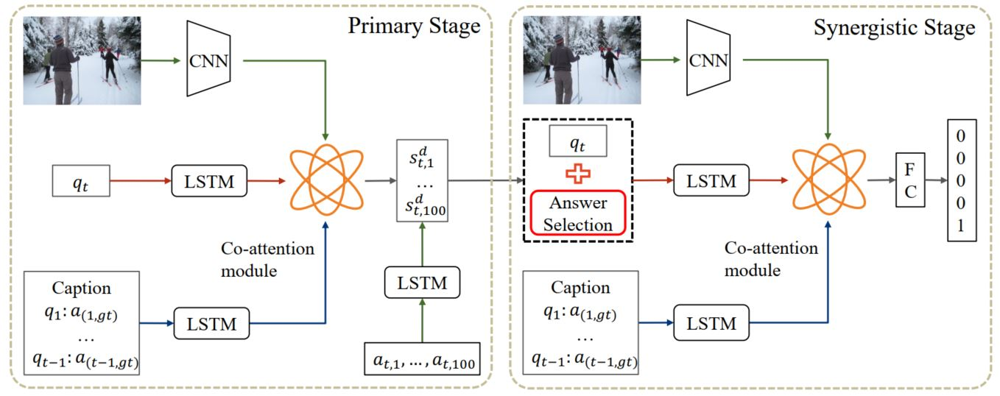

模型主要分为两阶段：第一阶段：对结果进行粗略的打分，第二阶段：对概率高的结果进行细粒度的分析，从而更好的选择出符合情境的答案。

首先是对模型的所有输入的处理，对图像，本文使用了Faster-RCNN来得到图像的特征表示$V = (v_1, v_2, ..., v_n)$，对于问题$q_t$，使用一个LSTM处理，得到问题的表示$m_t^q = LSTM(q_t)$，对于历史对话（包含图像描述）， $H = (H_0, ... , H_{t-1})$，其中$H_0$表示的是图像描述，而$H_i$是第i轮的问题和答案的拼接，$H_i=(q_i, a_{i,gt})$，同样也是使用LSTM处理历史对话，得到历史特征$U=(u_0, u_1, ..., u_{t-1})$，其中$u_i = LSTM(H_i)$，是LSTM的最后一个隐层状态。这样就得到了标准的输入，从而可以开始两阶段的建模分析。

在介绍两阶段的细节之前，首先介绍本文中使用的比较多的一个注意力计算方法，multi-modal factorized bilinear pooling (MFB)，这种方法可以可以克服两种特征分布的不同（例如：编码问题和历史对话的LSTM的输出，编码文本和图像的特征），从而实现特征之间的高效融合。在该计算方法中，两个特征$X, Y$之间的融合计算方法为：

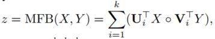

其中，$U, V$是参数，$k$是因子数，类似于multi-head attention中的head数量，为了使输出的稳定性更好，在本文中，作者加上了power normalization：$z \leftarrow sign(z)|z|^{0.5}$ 和L2 normalization：$z \leftarrow z/||z||$。以上整个过程记为$z = MFB(X, Y)$.

### Primary Stage

首先是获取问题$m_t^q$ 和历史对话 $U$ 的交互关系，常用的attention操作，计算出两者之间的attention，然后使用历史对话得到问题的另一种表示，具体如下：

$$z_t^h=MFB_h(m_t^q, U), \\ \alpha_t^h = softmax(\omega_{\alpha}^Tz_t^h), \\ m_t^h = \sum_{i=1}^{t-1}(\alpha_{t,i}^hu_i)$$

通过该公式，就可以得到问题需要关注哪部分历史对话信息，接下来就是将$m_t^h$和问题向量$m_t^q$ 作拼接，然后使用相同的注意力计算方式得到那部分图像信息需要被关注，即$z_t^v = MFB_v([m_t^q; m_t^h], V)$. 这样就得到了利用需要关注的图像特征表示的问题$m_t^v$，最后就可以学习到文本和图像的联合表示 $e_t^p = MFB_e([m_t^q; m_t^h], m_t^v)$

得到了文本和图像的联合表示之后，本文将visual dialog中的答案也考虑到建模过程中，而不是简单的做分类，那么首先就是利用一个LSTM将每个候选答案$a_{t, i} \in A_t$ 进行编码，然后计算和图像文本联合表示之间的相似度

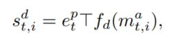

其中$f_d$是一个一层的MLP，使用tanh作为激活函数，因为该函数计算出的是候选答案和联合表示之间的相似度，那么正确答案的相似度应该是最高的，因此本文使用了N-pair loss，同时为了解决不平衡问题，本文增加了一个缩放系数（temperature）去降低不平衡的影响，具体如下公式：

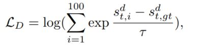

其中$\tau \leq 1$, 如果候选答案被正确打分，并且该分数是小鱼ground truth的，那么改候选答案的损失$l_{t, i} = s_{t, i}^d - s_{t, gt}^d$ 就会小于0，而$\tau$ 就可以降低该答案对整个模型的影响，从而保证了模型的效果。

至此，该阶段就完成了目标，对所有的候选答案进行粗略打分。

### Synergistic Stage

在第一阶段，由于打分函数或者其他问题，有些答案可能得到了不太合适的分数，因此该阶段的主要任务就是根据图像和问题对评分比较高的答案进行重新排序，（*即在第一阶段正确答案可能得到了比较高的分数，但不是最高的，如果直接根据第一阶段的分数来选出最后的答案的话，有可能会正确答案，但会错过最优选项，因此在该阶段对所有看似正确的答案进行重拍，从而选出最有答案*）。并且本文也通过实验证明了top 10的答案基本上覆盖了90%的正确答案，因此本文从答案集合$A_t$中选出了top N的结果，组成了新的答案集合$B_t = (b_{t,1}, ..., b_{t,N})$

而在处理答案过程中，因为一些答案很短，例如NO, Black and Grey等，并没有什么具体的含义，因此这里是将每个答案和问题进行拼接，然后将其送个LSTM进行处理

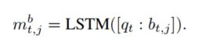

为了将该信息与历史对话以及图像信息进行联合建模，本文使用了和第一阶段相同的方法进行处理，但不同的是这里直接使用了第一阶段计算出来的历史对话加权向量表示，去计算对图像的注意力参数

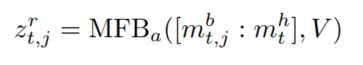

然后就是使用相同的注意力处理方式，对候选答案$b_{t,j}$ 进行加权表示，得到了需要关注的图像特征表示$m_{t, j}^r$，最后对这些内容做融合，$e_{t, j}^r = MFB_r([m_{t, j}^b; m_t^h], m_{t, j}^r)$，该向量表示的是和图像，问题以及历史对话进行协同建模之后的答案向量表示，最后将该向量表示送给一个一层的MLP进行打分，

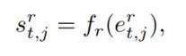

最后的最后，就是使用一个softmax函数进行分类，最合适的答案将拥有最高的概率。

## Experiment

本文是在[Visual Dialog V1.0](https://visualdialog.org)数据上进行相关实验的，评价标准使用的时一个鲁棒性更好的标准NDCG，而不是传统的检索指标，相关计算方式如下：

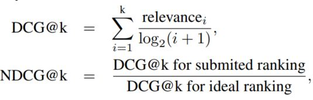

接下来是实验结果：

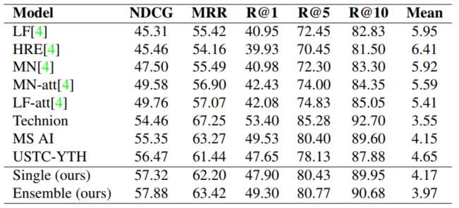

可以看出模型在几乎所有评价标准上都取得了最好的表示，当然直接看结果不够直观，本文也提供了一些case study，如下图：

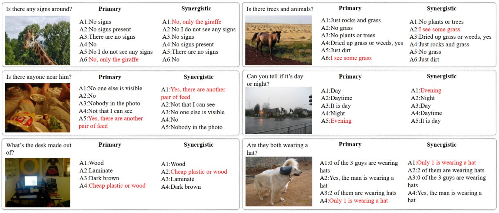

从结果上看，第一阶段虽然会选出来正确的结果，但是经过第二阶段之后，模型能够选出来更符合情境的答案，不仅仅是对问题的简单回答，而且包含了一些细节，这是非常有意思的一点，感觉这部分值得深入做一做，不仅仅说能够提供正确答案，同时还能提供对应的细节信息，从而使答案更局有说服力。

## Conclusion

本文聚焦于Visual Dialog任务中的答案上，提出了模型不仅仅需要给出正确的答案，还要给出更符合情境的答案，细节决定成败，尤其是在对话任务中，单单一个正确的答案并不能维持或者引导整个对话的进行，还需要有相应的细节信息，这样不仅能够使回答更具有说服力，而且为对话的维持提供了更多的可能，因此也更吸引人，本文的这个motivation还是非常有意思的，赞一个