> Title: Multi-step Reasoning via Recurrent Dual Attention for Visual Dialog 
>
> Authors: Zhe Gan, Yu Cheng, Ahmed EI Kholy, Linjie Li, Jingjing Liu, Jianfeng Gao
>
> Link: https://arxiv.org/abs/1902.00579

## Motivation

当前Visual dialog模型尽管已经取得了令人印象深刻的表现，但当问题涉及到图像的特定区域或者比较细节的对话片段时，模型就很难给出准确的答案。究其原因，单步的分析需要同时关于太多的信息，当需要特定的位置或者说需要对问题和图像，对话历史进行反复理解时，单步理解就收到了很大的限制。因此多步推理，从粗粒度到细粒度就显得十分必要的，这样模型才能关注到具体的细节，从而给出准确的答案，例如下图：

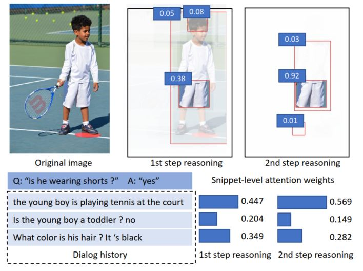

单步分析时，需要知道*He*指代的是历史对话中的*young boy*，还需要在图像信息中关注到*young boy*，然后才能具体知道他是否穿了短裤，但如果使用多步的话，第一步会从历史对话和图像中选出来和问题有关的部分，舍弃到并没有太大关联的地方，第二步就可以在这些相关的地方进行精细化的分析，从而准确得到答案。基于这样的一个想法，本文提出了一种多步的双重注意力模型，用于visual dialog。

## Model

还是先上整个模型框架图：

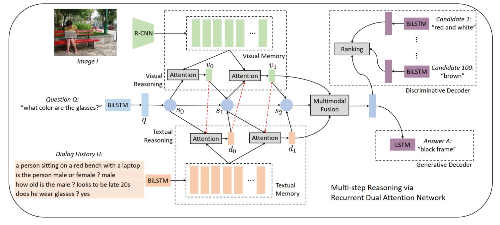

模型框架图加个外框感觉就好看很多，可以学习学习。从框架中可以看出模型主要包含三个模块：1）memory generation：生成一套文本和图像的memory，用于下一步的reasoning；2）Multi-step Reasoning：使用循环双重注意力去联合编码问题，图像和对话历史，用于接下来的解码；3）Answer Decoding：使用上一步得到的联合编码向量去推断答案。

### Memory Generation Module

首先是对数据的处理，对图像，使用Faster-RCNN抽取图像特征，$F_I = R-CNN(I) \in \mathbb{R}^{n_f * M}$，$I$表示的图像信息，这样就得到了图像中的object的向量表示，在这里$n_f = 36, M=2048$，也就是抽取了36个图像特征，同时使用一个非线性变换得到将这些特征映射到和问题相同的特征空间去 $M_v = tanh(W_IF_I)$.

对于文本的话，本文是直接将图像描述和历史对话完全拼接起来，这样就得到了一个长句子$H=(u_1, u_2, ..., u_L)$，$u_i$表示第i个词，L表示最大的句子长度，然后使用预训练的embedding进行编码，双向LSTM进行处理，最终就得到了文本的特征表示$M_d = [h_1, h_2, ..., h_L]$，具体实现如下：

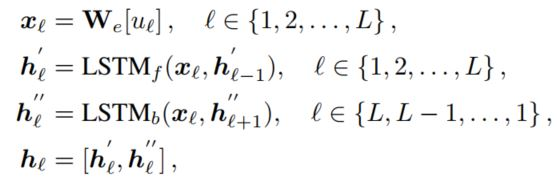

### Multi-step Reasoning Module

该模块的整体框架是一个RNN，每一步的隐状态表示的问题的当前表示，并会作为query去检索文本和图像信息，具体流程可以表示为$s_t \rightarrow v_t \rightarrow d_t \rightarrow s_{t+1}$，这个可以看作one-step reasoning，通过这样的一个循环方式，从而实现对细节的把握，从而最终给出正确的答案。

首先还是会利用一个双向LSTM对问题进行编码，得到问题的隐状态表示$M_q = [q_1, q_2, ..., q_K]$，接下来是首先利用self-attention对问题进行处理，从而得到问题的语义表示，而这些权重表明了问题中哪些词是非常重要的，并且过滤了那些不重要的词

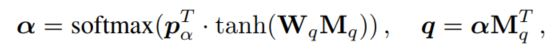

同时该状态会作为multi-step reasoning rnn的隐层初始状态（因为RNN的隐层状态都是对问题的语义表示），接下来就是不断使用注意力机制关注图像和历史对话中的重要信息，并用这些重要信息更新对问题的表示，从而一步步推进，最终得到正确的答案

1. $(s_t, d_{t-1}) \rightarrow v_t$

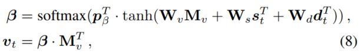

该步骤利用问题的隐状态表示和上一步的历史信息表示，得到图像上那些地方需要被关注，从而更新图像的需要关注表示，这里的公式应该是写错了，第一个公式的$d_t$应该是$d_{t-1}$的

2. $(s_t, v_t) \rightarrow d_t$

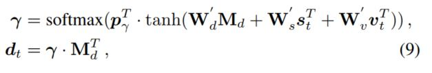

相同的操作，利用一直的信息更新历史对话中需要被关注的地方，得到历史对话的新的表示

3. $(v_t, d_t) \rightarrow s_{t+1}$

到这一步，已经得到了更新之后的图像特征表示$v_t$和历史对话特征表示$d_t$，一般情况下可以简单使用相同的注意力计算方法直接得到问题的更新表示，但这一步的意图和之前的是不同的，在之前的两步，是为了获取更多的有用的信息，因此使用注意力机制不断更新需要关注的地方，而这一步应该是将这些选择出来的信息进行融合，为回答问题提供辅助，也即这一步需要的是通过融合，得到送给RNN的输入，通过RNN的隐层状态更新，从而得到问题的新的表示。因此这里使用了MFB的方式来进行更新

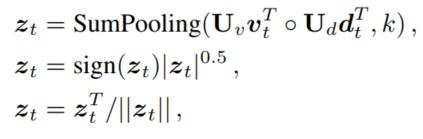

$z_t$表示的是t时刻RNN的输入，得到输入之后，利用RNN进行更新，这里使用的是GRU，即$s_{t+1} = GRU(s_t, z_t)$，

经过T轮之后，就得到了一系列的$\{s_t, v_t, d_t\}_{t=1}^T$，本文对这些内容再次进行融合，从而得到最后的语义表示向量

$$c_t = [MFB(s_t, v_t), MFB(s_t, d_t), MFB(v_t, d_t)], \quad C= \{c_t\}_{t=1}^T$$

### Answer Decoding Module

本文首先还是利用双向LSTM和self-attention对问题进行编码，得到每个问题的表示$a_j$，然后在问题和语义表示向量之间做点乘，得到一个相似度矩阵S, $S[t, j] = c_ta_j^T$。

在此基础上，需要使用不同的策略获取最后的答案，在这里作者使用了三种不同的策略：1）直接使用最后一个表示进行预测，$o = S[T, :]$； 2）使用所有步的平均表示 $o = \frac{1}{T}\sum_{t=1}^TS[t, :]$；3）使用随机dropout：在训练的时候以一定概率随机丢弃某些步的结果，用剩下的结果的平均进行组后预测，在测试的时候使用所有步的平均进行预测（这个不能算是单独的一个步骤吧，感觉就是训练时加了dropout）

在训练时，本文考虑了两种损失函数，交叉熵和n-pair损失，交叉熵好理解，将$o$送个一个分类层，n-pair损失的计算方式如下：假设第g个是正确答案，则损失定义为

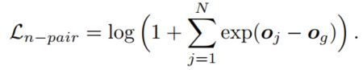

以上就是整个模型的技术细节

## Experiments

本文使用的数据集是[visual dialog V1.0](https://visualdialog.org/)，评价指标是(Normalized Discounted Cumulative Gain, NDGC)，相关实验结果如下：

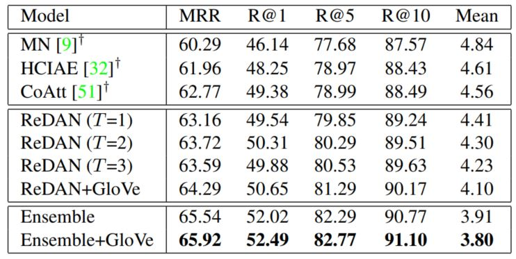

可以看出模型的实验结果是明显好于baseline的，而且随着reasoning的步数增加，模型的效果是在不断变好的，但这部分感觉可以测试更多的步骤，看看是否效果有明显的提升

接下来是一些case study

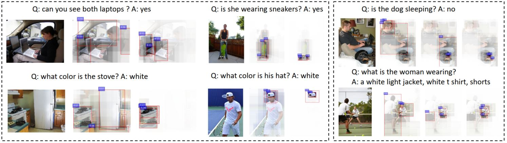

可以看出来模型是逐步从粗粒度到细粒度，慢慢关注到具体的细节，从而最终给出正确的答案，这部分感觉还是十分有意思的，而且在问题的生成模型中，可以看出模型不仅可以给出正确的答案，同时给出具体的细节内容，使回答更丰富，更具有说服力，如下图：

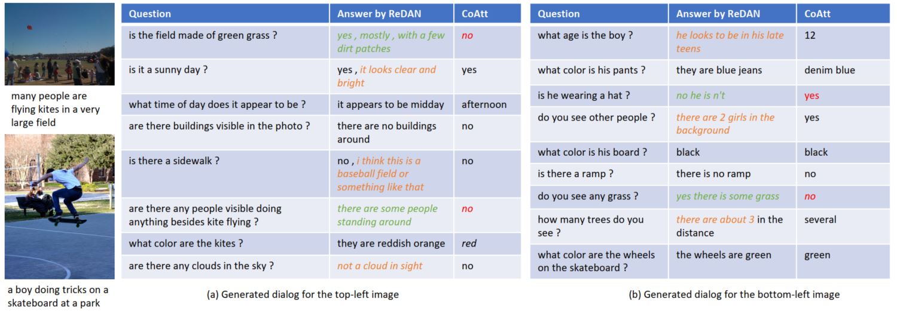

## Conclusion

本文针对当前模型无法回答细节问题，设计了一个multi-step reasoning的方法，从粗粒度到细粒度不断去更新需要关注的信息，从而使得模型能够根据已掌握的信息不断更新需要关注的内容，从而最终取得了正确的答案。这个思路感觉和人的一些习惯非常类似，我们并不是一步就得出了答案，而是根据已有知识不断更新自己的关注点以及对问题的理解，从而最终得到正确的答案，*罗马不是一天建成的*，这个思路非常值得关注。