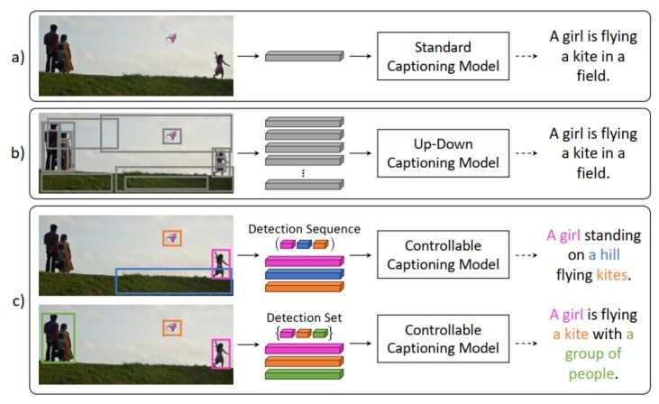
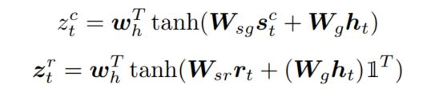
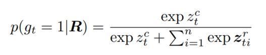
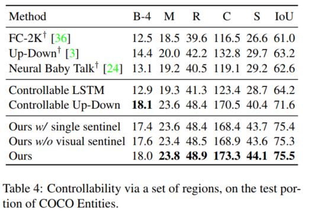

> Title: Show, Control and Tell: A Framework for Generating Controllable and Grounded Captions 
>
> Authors: Marcella Cornia, Lorenzo Baraldi, Rita Cucchiara 
>
> Link: https://arxiv.org/abs/1811.10652

## Motivation

Image captioning作为Visual-to-Language中一个十分传统的研究领域，每年都会提出一些新的方法，新的模型来生成符合图像的描述。但是整个过程到目前为止一直都是end-to-end，或者说是一个黑盒模型。而同一个图像可以有无数种不同的表述方法，注意力机制虽然可以帮助模型聚焦到图像的某一块，但该过程基本上是不可控的。如何增加生成过程的可控性，根据需要生成相应的描述称为image captioning的一个新的研究方向。而且该方向明显具有更大的应用潜力和实用价值。如下图：利用图像特征，甚至加上注意力机制，但最终生成的描述都是比较类似的。当对需要生成的对象进行控制的时候，就可以生成各有侧重性的描述，而且通过对应关系，也使得结果更合理可信。

因此本文就提出了一种新的image captioning的结构，通过对图像的region进行控制，从而生成更加多样化的描述。整体的出发点还是十分有意思的。

## Model

在介绍完整的模型之前，先简单介绍一个前提：自然语言天然是层次化的结构。这点很好理解，在传统的自然语言句子中，有细粒度的单词，然后是短语，然后是句子，接着是段落，文章等。本文提出了可以利用文中的名词将整个句子分成多个名词块（noun chunks），每个名词块由核心名词和对应的描述词组成。而这些名词块又能和图像的不同区域对应起来。这样，多样化的句子就可以通过对这些块的不同考虑，也就是通过考虑图像中的不同区域，从而生成不同的句子描述。下图给了这样的一个例子:

那么接下来就是模型的整体框架结构：

和传统的image captioning模型不同的地方在于：该模型的输入是图像$I$和一个region序列$R = (r_0, r_1, ..., r_N)$，后者就作为控制信号控制整个生成过程。

### Region序列

作为整个模型中非常核心的一部分，region序列关系到整个模型的生成质量，那么首先需要解决两个问题，1）region如何得到，2）region的序列如何控制。第一个很好得到，直接使用Faster-RCNN对图像进行目标检测就可以了，就可以得到整个图像中的目标特征表示，针对第二个问题，本文使用了一个sorting network来解决这个问题，具体如下：

首先输入包括：1）Faster-RCNN输出的目标特征表示（2048维）；2）使用Glove对每个region的类别进行embedding，因为每个类别可以用单词表示；3）归一化之后的目标框的位置和大小（4维）。接下来利用上图中表示的全连阶层进行处理，最后将其映射到一个N-dimension的描述向量，如果同一个region有多个检测目标，那么将所有的表示向量做average-pooing，保证每个region有一个向量表示，这里需要说明的一点是：最后得到的向量的维度适合检测到的region数是一样的，也就是说会有N个region，这是因为接下来的Sinkhorn network处理的是一个仿真，这点需要注意。

正如上文所述：当对所有的region进行处理之后，就得到了一个$N * N$的矩阵，接下来就可以通过Sinkhorn操作将其转化为一个 "soft"排列矩阵 $P$，具体就是执行L次连续的行归一化和列归一化，

当经过L次处理之后，通过Hungarian算法将结果转换为排列矩阵，就得到了排好序的region表示，

### Model Details

解决了输入的问题，接下来就是模型的主体部分，因为模型加入了一个控制信号，因此再生成的时候，不仅需要考虑生成 句子的合理性，$p(y_t|R,I)$，同时需要考虑生成的句子是符合给定的region序列的，也即句子中的名词块的转换概率是和输入的region序列是一致的，$p(g_t|R,I)$，其中$g_t$是一个布尔类型的转换门。

有了目标，接下来就是整个模型的生成过程了，因为要生成一个句子，因此RNN是一个非常好的框架，在生成每个隐层状态时，需要考虑前一个状态，当前的词，当前的region表示，即$h_t = RNN(\omega_t, r_t, h_{t-1})$，其中region的选择是通过上文提到的region转换门$g_t$实现的，具体如下：

那么接下来就是这个转换门$g_t$的计算方法了

因为整个模型中都是使用LSTM作为base model的，因此，在计算转换门的值的时候也需要考虑LSTM的状态相关信息，本文首先计算出一个哨兵值：

其中$h_{t-1}$是前一个时刻的隐状态值，$m_t$是当前时刻的cell memory值，这个计算方法还是很有意思的，一般使用LSTM的时候只会使用隐状态或者cell memory值，这里直接使用了两个，在得到哨兵值之后，本文接着计算隐状态和哨兵值之间的相似度，以及隐状态和当前region中每个表示之间的相似度（从这里可以看出，每个region其实最后是使用了一个矩阵表示的，这点目前存疑）

接下来就可以计算转换region的概率了，即

计算出转换门$g_t$的值之后，也就意味着建立了控制信号$R​$和生成过程之间的联系，接下来本文继续利用上一阶段的哨兵机制进行描述的生成。首先还是根据视觉信息生成一个哨兵向量，该向量控制模型是否要考虑当前region：

接下来利用additive attention计算出在当前region和哨兵向量上的注意力分布：

常规操作，通过这样的方式，就可以得到一个加权向量，从而作为LSTM在当前时刻的输入：

正如前文提到的，模型需要考虑两个目标，生成 句子的合理性，$p(y_t|R,I)$，以及句子中的名词块的转换概率是和输入的region序列是一致的，$p(g_t|R,I)$，因此目标函数也需要考虑这两部分：

其中$y_{1:t-1}^*$和$r_{1:t}^*$表示ground truth，两部分的损失均用交叉熵计算得到。同时为了更好的训练模型，本文在使用交叉熵训练过之后，同时使用了强化学习进行调优。具体细节不在这里赘述了，感兴趣的可以看一下原文。

以上就是整个模型的技术细节

## Experiments

本文使用Flickr30K entities和COCO entities两个数据集进行模型的训练和测试，同时根据region的不同设定（i.e.，a sequence of regions, a set of regions）对实验结果进行了评价，下文选取部分测试结果进行展示：

从实验结果上模型几乎在所有评价结果上都优于比较的baseline模型，充分说明了模型的有效性，同时本文也展示了一些实验结果，从而说明本文提出了控制方式的有效性

## Conclusion

针对大多数image captioning模型的黑盒结构，本文提出了一种通过外部控制信号显式的控制整个文本的生成，根据region及其顺序的不同而生成不同描述重点的句子。首先，因为对图像中的信息更加明确，所以生成的结果更贴近图像，效果更好，其次通过对描述重点的显式考虑，使得最后的生成句子多样性更好。从这两个角度实现了描述生成质量的提升。文章的想法还是非常有意思的，可能对image caption这部分内容了解的不是很多，文中有些地方还是有些疑惑的，感觉作者并没有讲清楚。不过并不影响这是一篇非常值得读的文章。