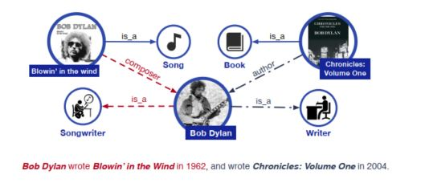
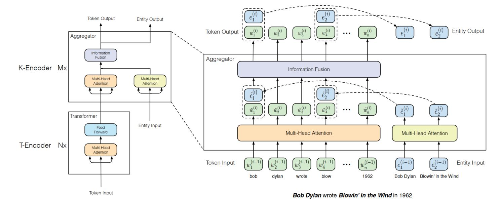
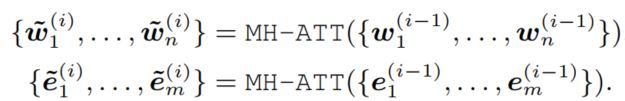
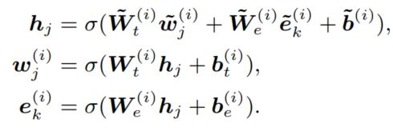
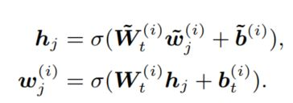
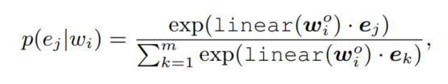
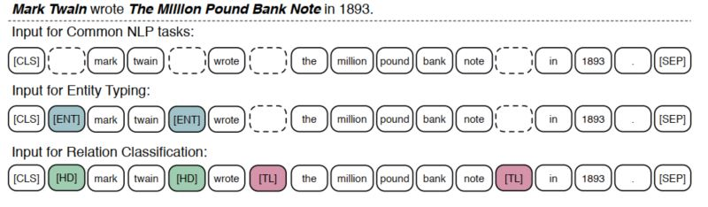
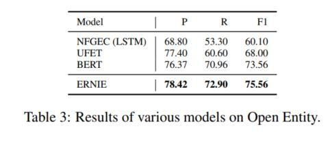
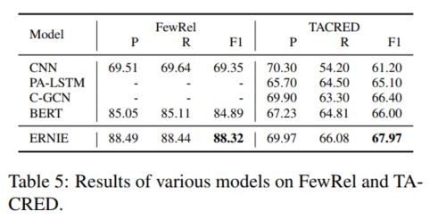
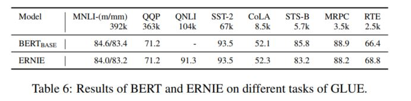

> Title: ERNIE: Enhanced Language Representation with Informative Entities 
>
> Authors: Zhengyan Zhang, Xu Han, Zhiyuan Liu, Xin Jiang, Maosong Sun, Qun Liu
>
> Link: https://arxiv.org/abs/1905.07129

## Motivation 

自从BERT被提出之后，整个自然语言处理领域进入了一个全新的阶段，大家纷纷使用BERT作为模型的初始化，或者说在BERT上进行微调。BERT的优势就在于使用了超大规模的文本语料，从而使得模型能够掌握丰富的语义模式。但BERT是否还有改进的空间呢？如下图，当提到*鲍勃迪伦*的时候，单纯依靠大规模的普通文本很难理解到底是指音乐家还是作者，但如果加入充分的先验知识，那么模型可能就会学习到更加精细化的语义表示，如何让BERT掌握更多的人类先验知识呢？本文就提出了一种方法，将知识图谱的信息加入到模型的训练中，这样模型就可以从大规模的文本语料和先验知识丰富的知识图谱中学习到字，词，句以及知识表示等内容，从而有助于其解决更加复杂，更加抽象的自然语言处理问题。

## Model Structure

整个模型的动机就是将知识图谱的信息有效融入到模型的训练中，考虑到BERT的复杂结构，如何将知识图谱的信息进行有效融合呢？作者提出了如下的结构：

可以看出，模型将BERT中的Encoder替换为了T-Encoder+K-Encoder，T-Encoder依然是对原来的文本进行编码，这部分和BERT是一样的，在K-Encoder中，可以看到输入输出都变成了两个，多了entity的信息。具体来说，首先可以利用TransE的方法对知识图谱中的内容进行表示，并对文本中的实体进行识别，这样文本中的实体都会有一个来自知识图谱的实体表示，需要注意的是文本的长度和实体的长度并不相等，然后先用mutli-head attention对文本和实体分别进行处理，得到在整个序列中情境感知的语义表示：

接下来就是对这两种信息进行融合，或者说利用实体的信息来增强对文本语义的理解，这个时候就分成两种情况：

1. 文本中的词有实体对应，一个很简单的思路，通过一个非线性变换，得到融合后的信息：

2. 文中的词没有实体对应，为了保证一致性，还是同样的方法，只是只有实体词的输入：

通过这样的方法，就将实体的知识信息融入到了对文本语义的增强表示中，接下来将相应的单元重复多次，就得到的最终的文本语义表示。

从模型上实现了知识图谱信息的有效融合，那如何训练么？如果单纯还是和BERT的训练方式相同，知识图谱的知识信息可能并不能如期望的那样进行有效融合，因此作者参考Masked Language Model设计了一个denoising Entity Auto-encoder (dEA)任务，用以训练模型对实体信息的感知和对齐，具体内容如下

## Training details

dEA的目的就是要求模型能够根据给定的实体序列和文本序列来预测对应的实体，首先是实体和文本之间的对齐概率计算：

这个公式也被当作训练dEA时的损失函数，有了目标，那么数据该如何准备呢？和Masked Language Model类似，作者对实体也做了如下处理：

1. 对于一个给定的文本-实体对应序列，5%的情况下，实体会被替换为一个随机的实体，这么做是为了让模型能够区分出正确的实体对应和错误的实体对应；
2. 对于一个给定的文本-实体对应序列，15%的情况下，实体会被mask，这是为了保证模型能够在文本-实体没有被完全抽取的情况下找到未被抽取的对应关系；
3. 对于一个给定的文本-实体对应序列，剩下的80%的情况下，保持不变，这是为了保证模型能够充分利用实体信息来增强对文本语义的表达。

和BERT类似，作者也对输入进行了一些调整，从而保证了模型能够自适应不同的任务，下图展示了针对三类自然语言处理任务的输入调整：

对于一般的NLP任务而言，知识在输入的头尾加上特定的开始结束符号，然后送给模型，并取[CLS]对应的输出作为输入句子的表示。对于一些知识驱动的任务，如关系分类，实体类别识别等任务，作者加入了特定的符号用以区分这些任务，对于实体类别识别任务，作者加入了 [ENT]来指导模型使用文本表示和实体表示进行最后的实体信息识别；对于关系分类任务，作者加入了[HD]和[TL]分别表示头实体和尾实体，然后使用[CLS]对应的特征向量来进行最后的分类。整个这部分的操作和GPT-2的无监督学习有些类似。

## Experiments

和BERT不同的是，作者首先在两个知识驱动的任务上进行了模型效果的验证：

1. Entity Typing：给定实体和对应的上下文，模型需要识别该实体的语义类型
2. Relation Classification：给定一个句子，模型需要识别出句子中的两个实体之间的关系

这两个任务都是知识驱动的任务，不单单需要模型能够掌握丰富的语义模型，同时需要模型能够有丰富的先验知识，这样才能进行准确识别和分类，下图是对应的实验结果：

从实验结果上看，模型取得了非常好的效果，这也说明了模型有效融入了知识图谱的先验信息，实现了文本语义的增强表示，同时作者还在常见的NLP任务上和BERT base进行了对比，实验结果也证实了模型的有效性

## Conclusion

自从BERT被提出后，NLP领域的研究形式也开始慢慢向CV靠拢，利用这些预训练好的超大模型获得丰富的语义模式，从而通过在具体任务上的微调获得最后的效果。但NLP和CV还是有很大不同的，自然语言是一种高度抽象的信息，单纯通过语言模型获取丰富的语义模式并不能一劳永逸的解决所有问题，而这篇文章就进行了这方面的一个尝试，通过引入外部先验知识增强模型的语义理解和表征。那是是不是还可以进行不仅仅是文本方面的增强，例如通过语音融入情感信息，通过图像引入视觉信息等，这些都是值得研究的地方。