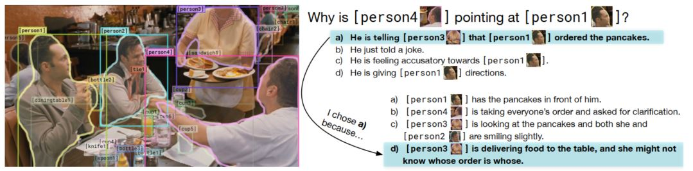
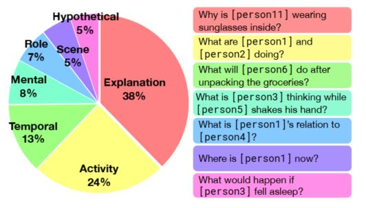
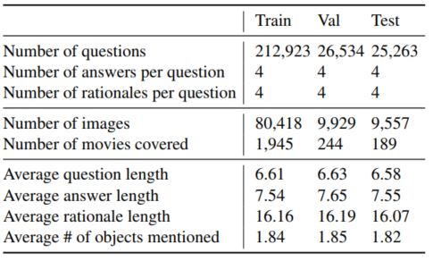
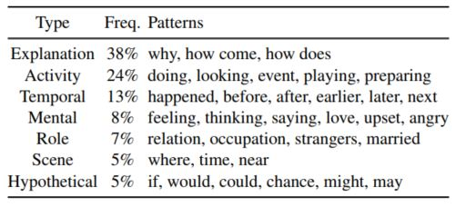
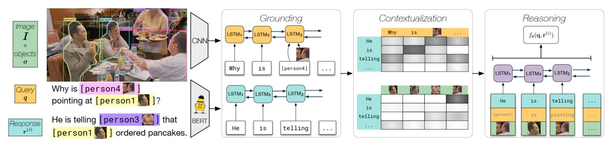
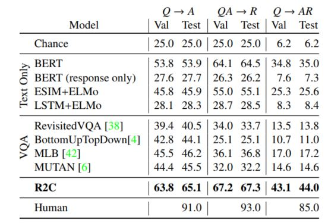

> Title: From Recognition to Cognition: Visual Commonsense Reasoning
>
> Authors: Rowan Zellers, Yonatan Bisk, Ali Farhadi, Yejin Choi 
>
> Link: https://arxiv.org/abs/1811.10830

## Movitation

当前Visual-to-Language (V2L)已经变成一个非常热门的领域，通过建模文本与图像，人们可以赋予机器更多的智能。例如图像描述生成（Image Captioning），视觉问答（Visual Question Answering）等。但机器是否真的拥有了智能，能够像人一样进行识别推理，还是仅仅抽取了相应的特征，通过发现视觉和语言中的一些特定模式来完成任务呢？很多研究人员更倾向于后者。如下图：当给人一张图时，人可以轻松的推断出画面中的人的行为，目的以及状态，例如我们可以很自然从图中看出people 4告诉people 3煎饼是people 1定的，并且给出恰当的理由，但这对机器来说就很困难的，因此为了更好的进行推理方面的研究，作者提出了Visual Commonsense Reasoning（VCR）任务，并公布了一个同名的数据集。

## Task & Dataset

### Task

和传统的VQA之类的任务不同地方在于，该任务不仅仅会提供图片和问题，同时作者利用Fast-RCNN等工具对图片中的目标进行了识别，并且使用了特定的目标标签进行标记，例如上图中的人全都被标记为person 1， person 2，person 3等，这样模型可以迅速找到目标，从而专注于对图像和文本的理解和推理；第二个不同的地方在于，问答并不是传统的有几个人，什么颜色的衣服等这些很简单很直观的问题，而是使用自然语言句子进行解释推理，更多是问为什么，接下来将会做什么等问题，从下图也可以看出，该数据集中的问题更多的是解释，活动描述等；第三个不同的地方在于，模型不仅仅需要选择出正确的答案，更要选择出为什么这么选的理由。这点也是我认为最巧妙的地方，目前也有一些任务需要对结果进行解释，但要不是进行可视化，要不是生成自然语言的解释，这么做的效果就会很差，因为自然语言生成本来就是一个很有挑战的问题。而在该任务中只专注于对图像文本的理解，答案选择出来的，解释也是选择出来的，因此模型能够更专注于解释和推理，而且直接用准确率进行效果的验证，也非常的简单直观有效。

考虑到该任务中有问题，答案，解释三个，因此该任务还有两个子任务：1）问题->答案：只是根据图像和问题进行答案的选择，推理难度稍低；2）问题+答案->解释：更进一步，根据图像，问题和答案，选择出合理的解释，相对前一个子问题稍难。通过这种多角度的分析验证，从而更好的对模型效果的评估。

### Data Collection

该数据集的图像来自于电影片段，因此大部分的画面都拥有复杂的情境而且情况也各不相同。为了保证抽取到的画面都比较复杂，作者提出了一种“interestingness filter”来确保图像的质量，大致的要求有：首先图片中至少有两个人，其次作者手动标了2000张图片，然后利用这个标记后的数据集训练一个分类器，用以区分图像是否有趣，在大规模人工标注阶段，还会让标注员回答这张图是非常有趣，一般般，还是很无聊，然后利用这些数据再次训练一个更大的分类器，再次进行数据的过滤，最后选择出最有意思的40k的图片。

关于问题和答案，在大规模人工标注阶段，标注员被要求问一个问题，然后回答他，并且提供相应的解释，为了保证文本的质量，作者同时加入了自动质量检测机制，每个问题必须包含4个词，答案必须包含3个词，解释必须包含5个词，并且这些文本中至少包含一个目标。当然后续作者还进行了质量检测等多个程序，从而保证整个数据集的质量。具体可以参考原文的索引，下图展示了数据集的一些统计信息

## Model

介绍完任务和数据，作者在本文中也提出了一种baseline方法，具体结构图如下：

该模型分为三部分：Grounding，Contextualization，Reasoning，

### Grounding

该部分主要是是学习图像文本的联合表达，因为问题和答案都包含了图像中的目标标签以及自然语言描述，因此可以使用图像信息对文本信息进行增强表达，作者使用Bi-LSTM来处理所有的文本，因为目标标签可以和图像上的具体区域进行对应，因此只有那些目标标签部分会同时加入对应的图像信息，这些图像信息使用上了CNN来学习特征表达，然后就得到了所有文本的增强表达。

### Contextualization

该部分主要是为了建模问题和答案之间的交互，这里就是用了注意力机制，作者在文中使用了co-attention来处理，最后就得到了问题的另一种表示，另外，为了使用图像对答案进行增强表示，防止有些信息在grounding阶段没有被获取到，作者使用了另一个注意力机制对答案信息进行增强。

### Reasoning

最后一个阶段，作者使用将问题，答案，以及图像中的目标送给一个Bi-LSTM进行处理，然后在所有的隐层状态上进行最大池化(max-pooling)，最后再使用一个MLP进行理由的选择。

整个模型还是比较简单的，为了获得更好地效果，作者还使用了BERT对文本进行处理，相关的实验结果如下：

作者选择了一些只用文本的模型，一些使用VQA的模型，因为这是一个更倾向于推理的任务，因此可以看到作者提出的模型效果还是最好的，但和人类相比就差的有点多了，这也说明了这个问题还远远没有解决，还有很大的研究空间。

## Conclusion

V2L是当前非常有一个的一个研究方向， 和纯CV，NLP不同的地方在于，它需要同时考虑图像文本的信息，相当于既有直观的视觉信息，也有抽象的语义信息，如何相互融合，如何相互协助就成了一个非常值得研究的的问题。当前很多V2L的任务其实并没有很好的去验证这两部分要求，通常都会倾向于其中的一个方面，而VCR这个任务则巧妙的提出了需要根据图像来推理接下来可能的行为，或者解释图中的行为，通过这种要求迫使模型更加专注于对文本图像的协同理解，而且对应的数据集最后落脚为一个分类任务，从而保证了模型能更专注于语义的理解和推理。这是一个非常有意思的问题，值得仔细研究一番。