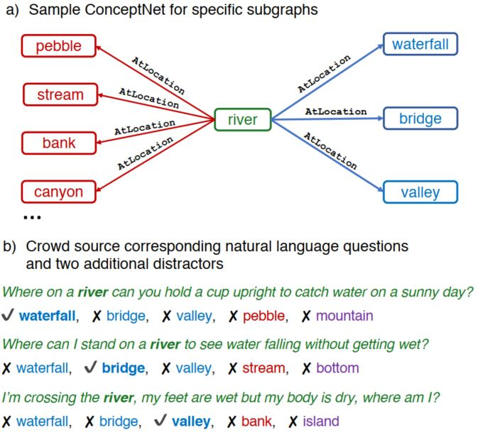

> Title: CommonsenseQA: A Question Answering Challenge Targeting Commonsense Knowledge
>
> Authors: Alon Talmor, Jonathan Herzig, Nicholas Lourie, Jonathan Berant
>
> Link: https://arxiv.org/abs/1811.00937

## Motivation

该文章是NAACL2019 best resource paper.

在现实环境中，人们回答问题时通常会考虑已拥有的丰富的先验知识（即常识），而当前的大多是QA任务中，并不需要额外的知识，单纯从给定的信息中就可以得出结果。那么这些数据中是否可以学习到常识呢？本文就提出了一种常识问答的数据集，该数据集提供了一个更加复杂的语义环境，需要依靠先验知识（常识）来进行区分。利用该数据集就可以更好的验证模型是否能够从数据中学习到丰富的先验知识，从而为更加复杂的推理等任务提供必要的支撑。

## Dataset 

首先展示该数据集的一个例子，如下图：

在这个例子中，*river*被称为source concept，其他词被称为target concept。从图中可以看出目标词和源词有着相同的关系AtLocation，但是在问题中，不同的问题需要使用不同尝试才能选择出正确的答案，例如问题1，在晴天把杯子举向空中还能接到水，一般情况下就只能是瀑布了，这里就需要对瀑布有一定的尝试理解。其他问题也是一样的，需要特定的常识信息才能选择出正确答案，单纯根据给定的文本是选择不出正确答案的。

为了保证所有的问题必须需要常识信息才能推断出正确的结果，作者选择使用conceptNet作为数据来源，然后进行抽取，具体如下：

首先是对conceptNet中的一些边进行过滤，例如一些很形式化的关系（有关系），或者可以直接从文本中获取的关系（isA）这种，对词也进行了一些过滤，例如一个concept超过了四个词或者不是英语。同时还考虑了不同词之间的相似关系，编辑距离（edit distance）过小的元组也会被过滤掉。通过这些人工规则保证了初始数据的高质量。

接下来就是大规模人工标注，首先针对每个source concept，会自动选择三个拥有相同关系的target concept，然后标注人员会被要求针对每个target concept提出一个问题，这个问题必须包含source concept，同时问题的答案只能是一个target concept，不能同时是两个答案。同时为了使问题更加复杂，需要考虑更多的尝试信息，每个标注员还被要求在选项中添加两个额外的答案，一个是来自conceptNet，并且和source concept拥有相同的关系，另一个由标注员自己设计，通过这种设计，保证了问题的复杂性，要求模型必须依靠常识信息进行判断，而不是单纯就本文信息就能得出答案。

为了保证标注的效果，作者还找了额外的标注员对问题的答案进行判断，每个问题有两个标注员进行判断，至少有一个标注员回答对，这个问题才会被作为有效的数据。以下就是整个数据集的一些关键统计信息

接下来作者展示了要想正确选择答案需要的一些常识，或者说选择出正确答案需要的一个推理过程

例子中红色的为正确答案，蓝色的为其他concept，可以看出要想回答出正确的答案，模型需要利用充足的常识信息进行推理和判断。而这个过程也可以作为对模型推理机制进行研究的一个方向。

## Experiments

有了数据集之后，作者选取了多种做语义理解和语义表征的模型，这其中还包括了GPT， BERT之类利用大规模数据进行预训练，并在多个NLP任务上取得很好的效果的模型，相关结果如下：

为了更好的验证模型的效果，作者还对数据集进行了划分，一种是随机划分，另一种是根据source concept进行的划分，训练集和测试集之间的source concept之间是没有重合的，从结果上看，随机划分的难度更大，而且所有的模型表现效果都远远低于人类的水平，即使是使用了大规模数据进行预训练的BERT-large，这也表明了BERT这种利用语言模型和大规模文本进行预训练的模型更多的是学习到了特定的语义模式，并没有从这些文本中学习到抽象的知识。这也可以认为是未来BERT的一个改进方向。

## Conclusion

现在已经有越来越多的研究开始关注于可解释性，抽象语义表达，知识表示，推理等高层次的语义理解，而不是单纯的利用大规模文本来学习特定的语义模式，自然语言处理也开始转向了理解，学习等人类特有的能力，通过不同的数据和特别设计的任务去验证模型在这方面的能力，从而推动整个自然语言处理领域向自然语言理解领域进发。这其中还有非常多有意思的内容值得我们去发现，去研究，去解决。