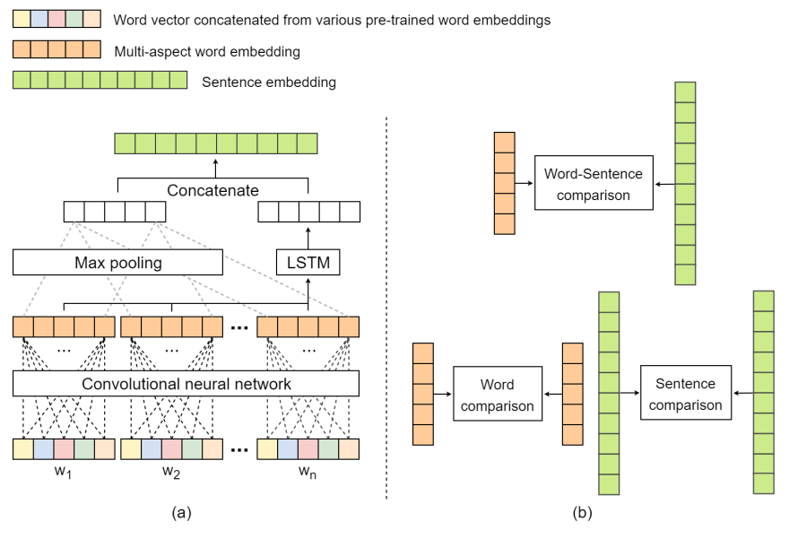
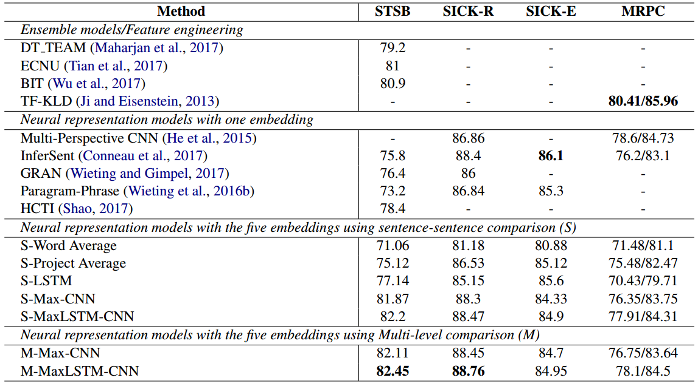

这篇文章主要是集中在对词的多方面语义表示，在此基础上实现对句子语义的准确理解，并在多个句子语义理解相关任务上取得了不错的表现。

> Different word embedding models capture different aspects of linguistic properities.

## 模型结构

不同的词向量模型获取的是不同的语义信息，例如：BOW的上下文反映的是词的domain信息（scientist and research），基于解释关系的上下文反映的是词的语义相似度信息（boy and kid），因此作者提出来通过选取不同的上下文来获取词在不同方面的语义信息，具体作者选了

1. word2vec：在Google News上进行训练的
2. fastText：在wikipedia上训练的
3. GloVe：选择的是300d的词向量，训练数据为Common Crawl
4. Baroni：使用的是context-predict的方法，使用的训练数据为English Wikipedia+British National Corpus
5. SL999：使用的训练数据为paraphrase database PPDB，然后再SimLex-999上微调

以下是模型的整体框架图：

### 输入处理

作者使用K个预训练的词向量表示每个词，然后将这些结果拼接起来，作为每个词的最终表示

$$e_w^{concat} = e_w^1\oplus e_w^2 \oplus ... \oplus e_w^K \tag{1}$$

### 卷积网络

为了学习到一个可以表示每个词的multi-aspect的语义，作者使用了一个卷积网络的结构，有H个卷积核，每个卷积核可以通过一个线性变换表示，具体如下：

$$e_w^{r_i} = \sigma(e_w^{concat}r_i^T + b_{r_i}) \\\\ e_w^{multi} = [e_w^{r_1}, e_w^{r_2}, ... , e_w^{r_H}] \tag{2}$$

### 句子建模

使用卷积网络的好处是参数共享，可以学习到局部特征，但是卷积神经网络有一个问题，在处理序列数据的时候容易丢失序列信息，因此作者在这里使用了LSTM来处理，从而保证了序列信息的保留，具体如下，作者首先在句子中所有词的相同纬度上进行max-pooling，获取到最有价值的信息，同时通过LSTM实现对整个句子的建模，然后选取最后一个状态作为句子的语义向量表示，最后将max-pooling的结果和LSTM的最后一个状态进行拼接，从而得到句子的语义表示，具体如下：

$$e_s^{max}[i] = max(e_{w_1}^{multi}[i], e_{w_2}^{multi}[i], ..., e_{w_n}^{multi}[i]) \\\\ e_s^{lstm} = LSTM(e_w^{multi})[-1] \\\\ e_s = e_s^{max} \oplus e_s^{lstm} \tag{3}$$

### 多尺度比较

有了每个句子的语义表示，根据任务的不同，就可以进行比较了，作者在这里选取了三种比较方式

1. word-word similarity：

$$A_{ij} = \frac{s_1^{multi}[i] \cdot s_2^{multi}[j]}{\left\|s_1^{multi}[i]\right\|\left\|s_2^{multi}[j]\right\|} \\\\ sim^{word} =  \sigma(W^{word}g(A)+b^{word})\tag{4}$$

这个公式中，g表示的是讲一个矩阵展平为向量的函数，这是词与词之间的相似度比较

2. sentence-sentence comparison:

   1. Cosine Similarity:

   $$d_{cosine}=\frac{e_{s_1}\cdot e_{s_2}}{\left\|e_{s_1}\right\|\left\|e_{s_2}\right\|} \tag{5.1}$$

   2. Multiplication vector & Absolute difference:

   $$d_{mul}=e_{s_1}\odot e_{s_2} \\\\ d_{abs} = |e_{s_1} - e_{s_2}| \tag{5.2}$$

   3. Neural difference:

   $$x = e_{s_1}\oplus e_{s_2} \\\\ d_{neu} = W^{neu}x + b^{neu} \tag{5.3}$$

   最后将这些不同的结果拼接起来，做一个线性变换

   $$d^{sent} = d_{cosine}\oplus d_{mul}\oplus d_{abs} \oplus d_{neu} \\\\ sim^{sent} = \sigma(W^{sent}d^{sent} + b^{sent}) \tag{5.4}$$

3. word-sentence comparison:

在这部分就是让句子1的语义表示和句子2的每个词的语义表示进行比较，然后将比较结果矩阵展平，通过线性变化，得到这一阶段的相似度值

$$e_{s_1}^{ws}[i] = e_{s_1} \oplus s_2^{multi}[i] \\\\ sim_{s_1}^{ws}[i] = \sigma(W^{ws}e_{s_1}^{ws}[i]+b^{ws}) \\\\ sim^{ws}=\sigma(W^{ws^{'}}[g(sim_{s_1}^{ws})\oplus g(sim_{s_2}^{ws})] + b^{ws^{'}}) \tag{6}$$

### 最后进行分类

在这一阶段，作者将三种不同的相似度信息进行拼接，然后通过线性变换，最后softmax进行分类

$$sim = sim^{word} \oplus sim^{sent} \oplus sim^{ws} \\\\ h_s = \sigma(W^{l1}sim+b^{l1}) \\\\ \hat{y} = softmax(w^{l2}h_s+b^{l2}) \tag{7}$$

最后的输出根据不同任务的不同有不同的修改。以上就是整个模型的过程。

## 任务

作者是在比较两个句子之间的相似度，因此作者在不同的几个任务上进行了比较，分别是1）RTE: SICK数据集；2）STS：STSB和SICK数据集，这部分需要吐槽的一点是在RTE任务上居然没有使用SNLI这个大规模数据集，可能是效果表现不好，个人感觉

## 效果

这里就贴一张结果图来展示作者实验的效果吧

## 个人评价

首先作者的这个idea还是很有意思的，我在16年的一篇工作也使用了同样的一个idea，基本的motivation也是相同的，只是他在多个不同的任务上进行验证，同时将多方面的词表示扩展到了句子的语义表示上，我那个工作只是在词级别上的一个分析，同时只考虑了Recognizing lexical entailment这个任务，这点是我的不足。但这篇文章在句子语义建模上有些简单，因此个人感觉他的句子语义表示向量的效果可能不是很好，但作者在最后的相似度上考虑了词对词，词对句子，句子对句子三个方面，这个还是很有意思的，这点值得学习一下，考虑多方面语义时不仅要考虑输入上的多方面，在比较上也可以进行多方面的比较。

以上就是这篇文章的整体介绍，介绍完感觉有必要介绍一下我自己的工作，下次介绍♪(＾∀＾●)ﾉ