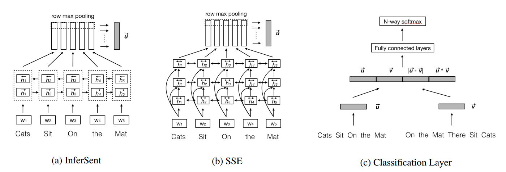
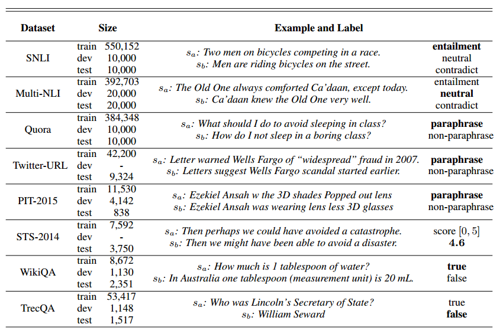
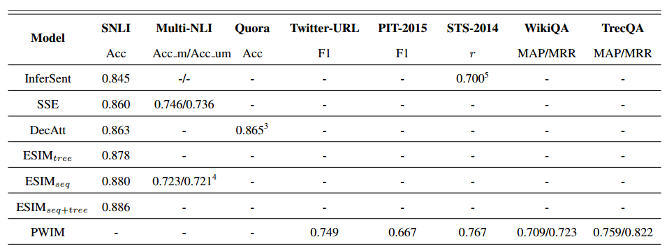
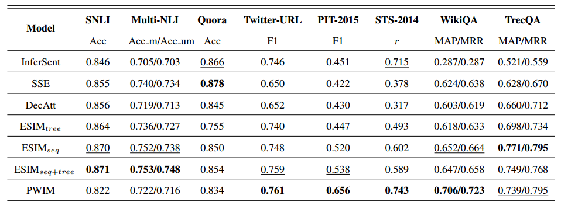

> Title: Neural Network Models for Paraphrase Identification, Semantic Textual Similarity, Natural Language Inference, and Question Answering 
>
> Author: Wuwei Lan, Wei Xu 
>
> Link: https://arxiv.org/pdf/1806.04330

## 介绍

这篇文章是COLING 2018的beat reproduction paper，文章主要对现有的做句子对任务的最好的几个模型进行了重现，并且作者实现出来的效果和原文章声称的效果相差不多，这点还是很厉害的，而且作者对语义理解的集中任务也做了相关梳理，文章简单易读，还是很值得一看的。

## 任务

句子对建模是NLP，NLU中比较基础，并扮演着重要角色的任务，主要集中在语义理解，语义交互上，也是我自己的一个研究方向，大致有这几类任务

1. Semantic Textual Similarity (STS) ：判断两个句子的语义相似程度（measureing the degree of equivalence in the underlying semantics of paired snippets of text）
2. Natural Language Inference (NLI) ：也叫Recognizing Textual Entailment(RTE)，判断两个句子在语义上是否存在推断关系，相对任务一更复杂一些，不仅仅是考虑相似，而且也考虑了推理。
3. Paraphrase Identification (PI) ：判断两个句子是否表达同样的意思（identifing whether two sentences express the same meaning）
4. Question Answering (QA) ：主要是指选择出来最符合问题的答案，是在给定的答案中进行选择，而不是生成
5. Machine Comprehension (MC) ：判断一个句子和一个段落之间的关系，从大段落中找出存在答案的小段落，对比的两个内容更加复杂一些。

## 模型

有了任务，作者选取了集中目前情况下最好的模型，因为原文中每个模型可能只针对了某些任务进行了很多优化，那这些模型是否真的有效呢，作者考虑这些模型在所有的任务上进行比较，在介绍模型之前，作者首先介绍了句子对建模的一般框架：

### 一般框架

1. 输入层：适用预训练或者参与训练的词向量对输入中的每个词进行向量表示，比较有名的Word2Vec，GloVe，也可以使用子序列的方法，例如character-level embedding
2. 情境编码层：将句子所处的情境信息编码表示，从而更好的理解目标句子的语义，常用的例如CNN, HighWay Network等，**如果是句子语义表示的方法，一般到这里就结束了，接下来会根据具体的任务直接使用这一层得到语义表示** 
3. 交互和注意力层：该层是可选的，句子语义表示有时候也会用到，但更多的是词匹配方法用到的，通过注意力机制建模两个句子在词层面的匹配对齐关系，从而在更细粒度上进行句子对建模，**个人认为句子语义表示也会用到这些，只是句子语义表示最后会得到一个语义表示的向量，而词匹配的方法不一定得到句子语义的向量**
4. 输出分类层：根据不同的任务，使用CNN，LSTM，MLP等进行分类判断。

下图展示了一些句子语义表示的模型的基本框架：

有了这个一般的框架，接下来作者选取了集中目前最好的模型进行重现

### 模型选择

1. InferSent[1]：BiLSTM+max-pooling
2. SSE[2]：如图1，和InferSent比较类似
3. DecAtt[3]：词匹配模型的代表，利用注意力机制得到句子1中的每个词和句子2中的所有词的紧密程度，然后用句子2中的所有词的隐层状态，做加权和表示句子1中的每个词
4. ESIM[4]：考虑了一些词本身的特征信息，和DecAtt比较类似
5. PWIM[5]：在得到每个词的隐层状态之后，通过不同的相似度计算方法得到词对之间相似关系，最后利用CNN进行分类。

## 数据：

为了更好的展示每个数据的情况，在这里直接用下图展示作者使用到的数据集：

## 结果

直接上结果，上图是原文章中的结果，下图是作者重现的结果

从结果上看，作者实现的效果还是很厉害的，基本上跟原文章声明的不相上下，当然由于不是针对特定任务进行特别优化，所有效果还是有一点点差的，但基本上可以认为是实现了原来的效果，而且作者也发现了一些有意思的现象，例如：表现最好的就是ESIM，个人感觉这里面加入了很多次本身的一些信息，例如近义词，反义词，上下位信息等，这些信息其实对句子语义理解十分重要。

以上就是这篇文章的整体介绍，作者完整实现了这些方法，并在不同的数据集上进行验证，工作量还是很大的，而且对句子对建模进行了比较完整的介绍，还是很有意思的。♪(＾∀＾●)ﾉ

## 引用

[1]：[Supervised learning of universal sentence representations from natural language inference data ](https://arxiv.org/pdf/1705.02364)

[2]：[Shortcut-stacked sentence encoders for multi-domain inference ](https://arxiv.org/pdf/1708.02312)

[3]：[A decomposable attention model for natural language inference ](https://arxiv.org/pdf/1606.01933)

[4]：[Enhanced LSTM for natural language inference ](http://www.aclweb.org/anthology/P17-1152)

[5]：[Pairwise word interaction modeling with deep neural networks for semantic similarity measurement ](http://www.aclweb.org/anthology/N16-1108)